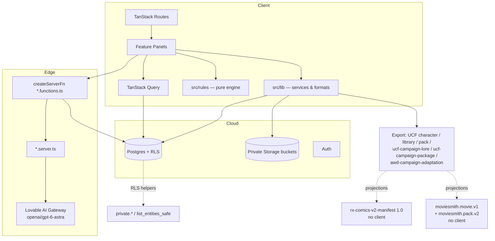
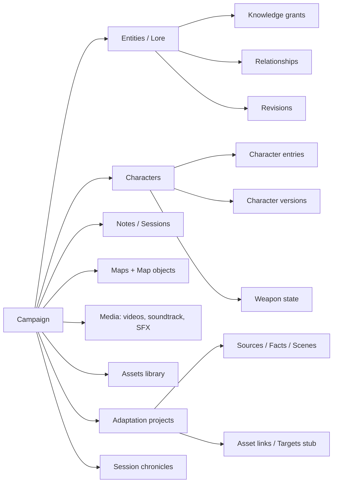
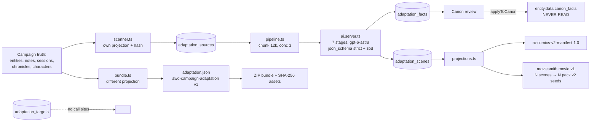
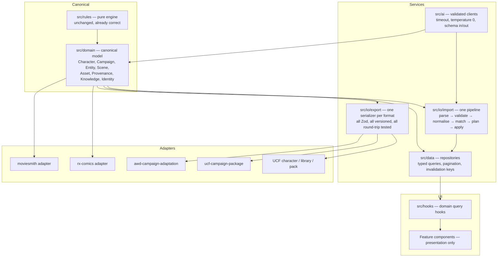
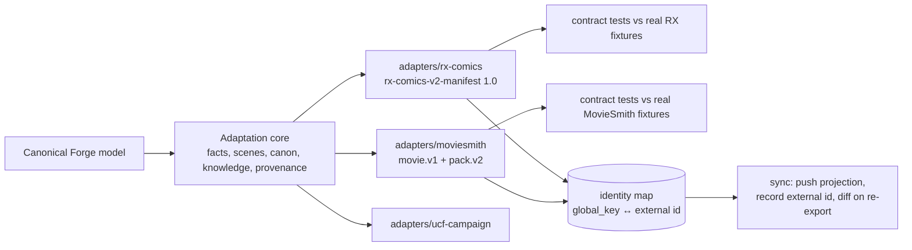

# HISTORICAL SNAPSHOT — NOT CURRENT TRUTH
**Date:** 2026-09-17
**Status:** Archived. Test counts and findings in this document are stale and reflect a past state of the project.
For current architecture and status, see [README.md](../../README.md).

---

# GURPS Forge Companion — Technical Assessment

**Assessment date:** 2026-09-17
**Scope:** Full read-only technical due diligence of the repository as it exists at this commit.
**Method:** Static inspection of all 42,718 lines of `src/`, all 48 SQL migrations, all 26 test files; execution of the test suite, type checker, linter and dead-code scanner; live runtime exercise of 8 authenticated routes in a headless browser with console/network capture.
**Constraint honoured:** No application file, dependency, migration, configuration, database row, policy or asset was modified. This document is the only file created.

---

## 1 Executive Summary

GURPS Forge Companion is a substantially built, single-developer-velocity TanStack Start + Lovable Cloud application for running GURPS-compatible tabletop campaigns: character sheets with a real rules engine, a campaign lore/world system with per-player knowledge grants, a battle grid, campaign media (video/soundtrack/SFX), content packs, import/export packages, and a Campaign Adaptation Studio that projects campaign canon toward downstream comic and film tooling.

**The headline is unusually positive for a project of this size and pace.** Three things are genuinely well engineered and should be protected in any future refactor:

1. **The rules engine is honest.** `src/rules/` is a pure, React-free, deterministic module where every configurable number lives in one `Ruleset` object. There are **zero** `APPROXIMATION` or `MISSING` classifications, and this is *enforced by a test* (`src/rules/__tests__/fidelity.test.ts:255-276`), not merely documented. The previously invented Basic Damage formula was removed and now returns `not-configured` rather than faking a progression (`src/rules/damage.ts:73-89`). A targeted grep of `src/components` and `src/routes` found **no reimplementation of rules arithmetic in UI code** — the UI consumes `buildSheet` output only. This is the project's strongest asset.
2. **The security posture is materially better than typical.** RLS is enabled with explicit `GRANT`s on all ~40 application tables. Every storage bucket is private with 8-hour signed URLs. A genuine GM-secret column leak (players could `select *` on `entities` and read `gm_notes`) was found and correctly fixed by replacing direct table reads with redacting `SECURITY DEFINER` table-functions (`list_entities_safe`, migration line 1613-1675). Every server function is wrapped in `requireSupabaseAuth`, and the single service-role usage (`push.functions.ts:78-107`) performs two RLS-scoped authorization checks before escalating.
3. **The build is green.** 273 tests pass, `tsgo --noEmit` is clean, the production build succeeds, and no runtime crash occurred across eight authenticated routes.

**The risk is not in what exists — it is in the seams between subsystems.** Four structural problems dominate everything else in this report:

- **There is no canonical domain model.** Character truth, campaign truth and adaptation truth are each re-derived independently by four or more modules. The scanner projects entities one way (`scanner.ts:182-204`), the bundle builder projects the same entities another way (`bundle.ts:80-103`), and three separate name-normalisation functions exist (`projections.ts:54-61`, `pipeline.ts:259-277`, `assets.ts:63-70`). Every new field must be added in several places or it silently disappears from one path.
- **Interchange formats have two incompatible standards of rigour.** `campaign-package.ts` is fully Zod-validated with `.strict()` and a cross-reference validator. The *character* format — the most important one in the product — has **no validation whatsoever**: `parsePortable` checks one string and casts (`src/lib/portable.ts:29-35`).
- **Import is not idempotent anywhere.** No import path — character, library, pack, lore, or campaign package — deduplicates against existing data. Importing the same file twice produces two complete duplicate data sets.
- **Trait matching cannot see specialisations.** `normaliseName` strips all parentheses before indexing (`src/lib/trait-match.ts:48-56`), so `Guns (Pistol)`, `Guns (Rifle)`, `Area Knowledge (City)` and `Bad Temper (12)` all collapse to the same match key. This is the root cause of the class of import bug the probe traits were chosen to detect.

One confirmed arithmetic bug exists in the rules engine itself: negative point costs round the wrong way, and a −1-point disadvantage with a −50% limitation evaluates to `-0` (verified by execution, §16.1).

**Recommended posture:** do not rewrite. Fix the confirmed correctness bugs, harden the character format to the standard the campaign format already meets, extract a canonical domain model, and make import idempotent. The architecture is salvageable and in places exemplary.

---

## 2 What Forge Does Today

Classification is based on reading the implementation, not labels or UI.

### Production-ready

| Feature | Evidence |
|---|---|
| Rules engine core (attributes, points, skills, encumbrance, defences, dice, health) | `src/rules/*.ts`, 273 passing tests, zero UI duplication |
| Campaign ruleset overrides / house rules | `src/rules/campaign-ruleset.ts`, `campaign-rules.tsx`, 7 tests |
| Row-level security and storage privacy | 48 migrations, all buckets private + signed URLs |
| Authentication and server-function authorization | `auth-middleware.ts`, all `*.functions.ts` gated |
| Visibility / knowledge-grant model | `src/lib/visibility.ts`, 9 tests, `list_entities_safe` redaction |
| Internationalisation (en / pt-BR) | 17 namespaces, ~2,338 keys, parity enforced by `i18n:check` and a test |
| Campaign package format (`ucf-campaign-package`) | Full Zod `.strict()` + cross-reference validator + atomic rollback |

### Functional but fragile

| Feature | Why fragile |
|---|---|
| Character import (single file) | No schema validation; non-atomic; not idempotent; trait matching blind to specialisations |
| Trait reconciliation / canonical matching | Non-deterministic AI fallback; silent failure indistinguishable from success |
| Lore entity editing | Local form state mirrors query data with no dirty guard; realtime invalidation can clobber in-flight edits (`entities.$id.tsx:211-213`) |
| Character autosave | Debounced 700 ms with no in-flight guard and no navigation block; edits inside the window are silently lost |
| Asset image resolution | Guesses the bucket by trying two in sequence, producing a 400 per miss (confirmed at runtime) |
| Battle grid realtime | Invalidates the whole map-object list on every single token move |

### Partial

| Feature | Gap |
|---|---|
| Campaign Adaptation Studio | Export-only. No import path, no sync write-back |
| Provenance model | Single enum column, no history; "AI-suggested" and "AI-accepted" are indistinguishable |
| Canon Review | Bulk "Confirm all" approves without displaying content |
| Pack lifecycle | Pack↔content linkage is by free-text name with no FK; cleanup is app-level and N+1 |
| Prerequisites | Stored as free text, read by nothing |

### Prototype

| Feature | State |
|---|---|
| RX Comics projection | Schema and builder exist and are tested; no client, no service call, conformance unverifiable |
| MovieSmith projection | Same. Multi-scene support is genuinely correct (does not flatten) |
| Session Chronicle AI reconstruction | Works, but AI JSON is cast without a schema guard in the component (`session-chronicle-panel.tsx:187-200`) |

### Stub / planned-only

| Feature | Evidence |
|---|---|
| Adaptation sync / targets | `adaptation_targets`, `listTargets`, `upsertTarget` defined in `api.ts:469-497`, **zero call sites** |
| `global_entity_id` | Does not exist anywhere in the repository (full-repo grep, zero hits) |
| Cron endpoints | `cron-auth.ts` implements timing-safe comparison correctly but is called by nothing |
| `canon_facts` on entities | Written by `canon-step.tsx:79-104`, **read by nothing** |
| Adaptation `impact` AI stage | Produces page/runtime estimates consumed by no builder and rendered nowhere |

---

## 3 Current Architecture

| Layer | Technology / location |
|---|---|
| Framework | TanStack Start v1 (React 19, Vite 8, file routes in `src/routes`) |
| Routing | `@tanstack/react-router` 1.170, generated `routeTree.gen.ts` |
| Backend | Lovable Cloud (Supabase Postgres + Storage + Auth) |
| Server logic | `createServerFn` in `*.functions.ts`, logic in `*.server.ts`; one public route `api/public/version.ts` |
| Auth | Supabase JWT; `requireSupabaseAuth` middleware; bearer attached client-side in `src/start.ts` |
| Authorization | Postgres RLS + `private.*` / `public.*` SECURITY DEFINER helpers |
| State | React local state + TanStack Query v5 (`staleTime` 30 s, `refetchOnWindowFocus` false, `retry` 1 — `router.tsx:9-14`) |
| Realtime | Supabase channels: lore, battle, soundtrack, SFX (4+ concurrent per campaign page) |
| Domain logic | `src/rules/` (pure), `src/lib/` (services + formats), **plus significant leakage into route components** |
| AI | Lovable AI Gateway, `openai/gpt-6-astra`, `/v1/responses` with `json_schema strict:true` + client-side Zod re-validation |
| File processing | `fflate` (ZIP), `@jsquash/avif` (image conversion), `three` (3D models) |
| Styling | Tailwind v4 via `src/styles.css`, shadcn/Radix components |
| Observability | `reportLovableError` at the root boundary only |
| Build | Vite → Cloudflare Worker edge runtime |





---

## 4 Application Map

**Routes** (`src/routes`): `/` (marketing), `/auth`, `/legal`, `/sitemap.xml`, `/api/public/version`, and under `_authenticated/`: `dashboard`, `characters` (index + `$id`), `campaigns` (index + `$id`), `entities/$id`, `library`, `packs` (index + `$pack`).

**Roles:** account owner; campaign GM (`campaigns.gm_id`); campaign member (`campaign_members`); character owner (`characters.owner_id`). There is no separate `user_roles` table — roles are relational to a campaign, which is appropriate here.

**Campaign page tabs** (`campaign-nav.tsx`): Cast (Roster, Members) · Play (Battle Grid, Rolls, Sessions) · World (Lore, Timeline, Graph, Library) · Story (Story, Reveals, Notes) · Settings (House rules, Adapt — GM-only) · Media.

**Key journeys traced:**
- *Create/edit character* → `characters.$id.tsx` → debounced autosave → `buildSheet(record, entries, campaignRuleset)`.
- *Import character* → file → `parsePortable` → `reconcileImportedEntries` → local match → AI fallback → `createCharacter` + N× `addEntry`.
- *GM reveals lore* → `reveal.ts` → knowledge grant → notification → optional Web Push.
- *Player reads lore* → `list_entities_safe` RPC (GM fields redacted server-side).
- *Adapt campaign* → 12-step wizard → scan → chunk → AI stages → facts/scenes → canon review → manifest ZIP.

---

## 5 Domain Model

### 5.1 What is modelled well

`Visibility` is a single first-class enum (`GM_ONLY`, `UNREVEALED`, `SELECTED_PLAYERS`, `ALL_PLAYERS`, `PUBLIC`) centralised in `src/lib/visibility.ts` with legacy values normalised by migration — this is the cleanest domain concept in the project. `Ownership` is consistently `owner_id`/`gm_id` + `campaign_members`. `KnowledgeState` (`spoilers.ts:25-33`) is genuinely rich: world truth, GM knowledge, player knowledge, per-character knowledge, reveal targets, witnesses — with an enforced "never invent knowledge, default to unknown" rule.

### 5.2 Confirmed model defects

| Defect | Evidence |
|---|---|
| **No canonical entity identity across systems.** Identity is the local Postgres UUID. `global_entity_id` does not exist. Downstream systems receive `entity_id` (internal UUID) + a `slugify(name)` key with no declared write-back mechanism. | Full-repo grep: zero hits. `protocol.ts:158-159`, `bundle.ts:93` |
| **Two competing sources of truth for `is_npc`** during campaign-package import. | `campaign-package-import.ts:189` — `entry.is_npc ?? record.is_npc ?? false` |
| **Pack membership is a free-text string, not a relation.** `characters.packs[]`, `library_entries.pack` and `content_packs.name` are linked only by matching text; consistency is maintained by an app-level N+1 loop. | `api.ts:526-607`, no FK in migrations |
| **`Prerequisite` is modelled but inert.** `TraitData.prerequisites` / `SkillData.prerequisites` are free text read by nothing. | `src/rules/types.ts:39,78`; no consumer in `src/rules` |
| **`Provenance` is a label, not a chain.** One enum column with no history, actor or timestamp. A GM-edited AI fact keeps `ai_inference` but there is no record of the edit; a bulk-approved fact is indistinguishable from a read-and-approved one. | `types.ts:8-15`, `api.ts:316-336` |
| **`CanonState` is written to a field nobody reads.** `entity.data.canon_facts` has zero consumers. | `canon-step.tsx:79-104` + repo-wide grep |
| **Two independent entity-kind → category maps** that must be hand-synced. | `bundle.ts:105-113` (`KIND_GROUP`) vs `assets.ts:49-57` (`KIND_ROLE`) |
| **`private.gm_data_keys()` is a hand-maintained SQL literal mirroring `src/lib/entity-kinds.ts`.** The SQL comment admits it. Adding a GM-only field client-side without a migration leaks it to players. | Migration line 1483 |
| **JSONB blobs replace typed columns** for `characters.appearance`, `character_entries.data`, `entities.data`, `adaptation_*.source_scope`/`creative_settings`/`story_beats`/`dialogue`. Validated only where zod happens to be applied. | Migration lines 128, 173, 175, 528-545 |

### 5.3 Concepts absent from the model

`Arc`, `Adventure`, `Chapter` exist as entity *kinds* inside the generic `entities` table with `parent_id` self-reference — there is no typed hierarchy, no depth constraint, and no guarantee an Adventure's parent is an Arc. `Clue`, `Secret`, `Faction`, `Organization` are likewise entity kinds. This generic-entity approach is a defensible trade-off for flexibility but means **no structural invariant of the campaign hierarchy is enforced by the database**.

---

## 6 GURPS Rules Architecture

All rules live in `src/rules/`, pure and React-free. Every tunable number is in `defaultRuleset` (`ruleset.ts:70-113`) and every field is exposed for per-campaign override through `RULESET_FIELDS` (`campaign-ruleset.ts`), merged by `mergeRuleset` and applied via `buildSheet(record, entries, ruleset)`.

### 6.1 Fidelity classification as actually coded

Verified against `src/rules/audit.ts` and `docs/rules-audit.md`; **every claim matches the implementation.** No entry is misrepresented.

| Rule | Class | Implementation |
|---|---|---|
| ST/DX/IQ/HT cost | CONFIGURABLE | `attributes.ts:50-65` |
| HP/Will/Per/FP | CONFIGURABLE | `attributes.ts:38-41` |
| Basic Speed / Move | CONFIGURABLE | `attributes.ts:31-32` |
| Basic Lift (ST²/divisor) | CONFIGURABLE | `attributes.ts:24-27` |
| Point totals | EXACT | `points.ts:61-96` |
| Levelled traits | EXACT | `points.ts:37-45` |
| Enhancements/limitations | CONFIGURABLE | `points.ts:24-35` |
| Skill relative level | CONFIGURABLE | `skills.ts:9-20` |
| Skill defaults | CONFIGURABLE | `skills.ts:49-93` |
| Techniques | CONFIGURABLE | `skills.ts:168-201` |
| Encumbrance | CONFIGURABLE | `equipment.ts:36-72` |
| DR by location | CONFIGURABLE | `equipment.ts:81-96` |
| Dodge / Parry / Block | CONFIGURABLE | `attributes.ts:45`, `defenses.ts` |
| **Basic damage** | **CONFIGURABLE, no data bundled** | `damage.ts:73-89` returns `not-configured` |
| HP/FP thresholds | CONFIGURABLE | `health.ts:19-37` |
| Weapon stat parsing | CONFIGURABLE | `weapons.ts` |
| Dice expressions | EXACT | `dice.ts:24-33` |
| 3d6 success/criticals | CONFIGURABLE | `dice.ts:64-78` — correctly implements ≤4, 5@≥15, 6@≥16, 18, 17@≤15, margin≥10 |

### 6.2 Verified-correct areas

- **Critical success/failure branch ordering is non-overlapping and correct** (`dice.ts:70-76`). Well tested.
- **Basic Lift float noise is explicitly trimmed** (`Math.round(raw * 1e6) / 1e6`); ST 11 → exactly 24.2, ST 13 → exactly 33.8, asserted in `fidelity.test.ts:264-276`.
- **HP/FP threshold selection correctly finds the deepest matching tier** via descending sort + overwrite (`health.ts:19-37`), verified at fraction −1.1 → "Death risk".
- **No rules arithmetic is duplicated in UI.** All 23 `Math.*` occurrences in `src/components`/`src/routes` are presentational (percentages, durations, canvas geometry, file sizes).
- **The refusal to bundle a damage progression is correct and deliberate**, and the honesty is enforced by test rather than trusted.

### 6.3 Defects — see §17 for full detail

Negative-cost rounding (`points.ts:34`), speed-delta cost rounding under non-default ruleset (`attributes.ts:62`), uncapped techniques when `defaultPenalty` is omitted (`skills.ts:190-192`), inconsistent `relative`/`label` when a default beats a purchased level (`skills.ts:143-147`), dropped RoF `!` marker (`weapons.ts:58-70`), inert prerequisites, unvalidated non-integer deltas, float-boundary encumbrance comparison (`equipment.ts:51-58`).

---

## 7 Character Import Architecture

```
file → JSON.parse → parsePortable (format string only)
     → reconcileImportedEntries
          → listLibrary()                         [failure → silent pass-through]
          → buildCatalogue / catalogueIndex
          → matchLocally (normalised name + kind)
          → unmatchedItems → candidatesFor
          → matchImportedTraits (server fn, zod-validated input)
               → AI gateway, openai/gpt-6-astra   [failure → silent pass-through]
          → resolveMatches (AI answer re-checked against real index)
          → reconcileEntries → applyCatalogue (stamps source.imported_as)
     → createCharacter
     → for each entry: await addEntry             [non-atomic, no rollback]
```

There is **no upload/OCR/PDF/DOCX stage** — import is JSON-only. AI is used solely for trait-name reconciliation, not for extracting facts from documents. That is the right boundary.

**Strengths:** the AI's answer cannot inject a fabricated trait — `resolveMatches` (`trait-match.ts:154-167`) looks the returned string up in the real catalogue index and discards anything not found. Input to the server function is zod-bounded (80 items / 400 candidates). Renamed entries are stamped with `source.imported_as`.

**Weaknesses:** see §18.

---

## 8 PACK and Schema Architecture

Ten distinct formats are read or written. Rigour varies by an order of magnitude.

| Format | Version | Validation | Version enforced? |
|---|---|---|---|
| `universal-character-forge` | 1 | **None** — one string check then cast (`portable.ts:29-35`) | **No** |
| `universal-character-forge-library` | 1 | Hand-rolled presence checks (`portable.ts:153-170`) | No |
| `universal-character-forge-pack` | 1 | Hand-rolled; also accepts a library file (`portable.ts:291-350`) | No |
| `ucf-campaign-lore` | 1 | Hand-rolled | **Yes** (reject-only, `lore-portable.ts:116`) |
| `ucf-campaign-package` | 1 | **Full Zod `.strict()` + cross-reference validator** (`campaign-package.ts:170-283`) | **Yes** (reject-only) |
| Soundtrack pack (standalone) | 1 | Full Zod `.strict()` | Yes |
| Soundtrack (embedded in campaign package) | — | Zod, **narrower schema than standalone** | n/a |
| Sound FX pack | `packVersion: 1` | **None** — manual `typeof` checks; `packVersion` never read | **No** |
| Calendar pack | none | None; implicit legacy-shape migration in `calendarOf` | No envelope at all |
| Timeline events pack | none | None; manual coercion | No envelope at all |
| `awd-campaign-adaptation` | 1 | Full Zod + `validateAdaptationManifest` cross-checks | Yes |

**`campaign-package.ts` is the reference implementation the other nine should be measured against.** It alone validates paths exist in the ZIP before any write (`campaign-package-import.ts:69-72`), checks duplicate keys, unknown `parent_key`/`character_key`/relationship endpoints, unique intro video and contiguous track positions, and rolls back the created campaign on any failure (`campaign-package-import.ts:136-139`).

Parallel/unofficial duplicates of the same concept are catalogued in §19.

---

## 9 Campaign Architecture

Hierarchy is **not** a typed `Campaign → Arc → Adventure → Chapter → Scene` chain. It is `campaigns` → generic `entities` rows discriminated by `kind`, self-nested via `parent_id`. Story structure kinds (arc, adventure, chapter, scene, quest, mystery) are configured in `src/lib/entity-kinds.ts` and rendered by `story-panel.tsx`.

**Consequences:**
- `parent_id` is `ON DELETE SET NULL`, so deleting an Arc **orphans** its Adventures into the root rather than cascading or blocking. Confirmed in migrations; no UI warns about this.
- No constraint prevents a Scene being parented to a Faction, or a cycle beyond what the UI happens to prevent.
- Reordering/duplication relies on `sort_order` integers with no gap-management strategy.
- `entity_relationships` has **no unique constraint** on (source, target, rel_type) — duplicate relationships are insertable.

**Stable-ID strategy:** within a single export, keys are deterministic (`entityKey` = `kind:slug:uuid-prefix`, `lore-portable.ts:53-61`). Across exports of the same logical entity from different campaigns, keys differ. There is no upsert-by-key on import, so re-import always creates new rows (§19).

---

## 10 Campaign Adaptation Architecture



**Implemented and real:** Story Bible (as JSON in `creative_settings`), Adaptation Manifest (strict Zod + cross-reference validation + docs), Session Chronicle (two tables + CRUD + UI), Canon Review UI, Provenance enum, Knowledge State derivation, Asset Resolver (explicit links beat normalised-name matching, ambiguity surfaced), Asset Transfer (download → SHA-256 → dedupe → ZIP), 12-step resumable wizard, deterministic local diffing with `manually_edited` protection.

**Stub or missing:** no adaptation-package *import* path at all (the inverse exists for campaign packages); `adaptation_targets` / `listTargets` / `upsertTarget` have zero call sites; no external RX or MovieSmith client; no `global_entity_id`.

**MovieSmith multi-scene is correct.** `movieProjectionSchema` (`protocol.ts:323-349`) carries `scenes: movieSceneSchema[]` (max 500), each embedding its own `moviesmith.pack.v2` seed. Each `AdaptationScene` maps 1:1 to one movie scene (`projections.ts:174-223`). Scenes are **not** flattened.

**The critical structural flaw:** projections read a reasonable intermediate model, but campaign truth is re-derived independently by the scanner and the bundle builder from the same `entities` rows into two different shapes. A field added to entities must be added in both or the hash and the manifest disagree.

---

## 11 Findings Summary

| ID | Severity | Category | Confidence | Area | Problem | Impact | Evidence | Recommendation |
|---|---|---|---|---|---|---|---|---|
| F-01 | CRITICAL | GURPS RULES | Confirmed | `points.ts:34` | `Math.round` on negative costs rounds toward +∞; `modifiedCost(-1,[-50%])` returns `-0` | Disadvantage point values silently wrong; `-0` can reach the UI | Executed: `-1/-50% → -0`, `-15/-50% → -7` vs `15/-50% → 8` | Round half away from zero; normalise `-0`; add negative-base tests for all three modes |
| F-02 | CRITICAL | IMPORT | Confirmed | `portable.ts:29-35` | Character format has no schema or version validation | Malformed/hostile/truncated files write bad data into characters | One string comparison then `as PortableCharacter` | Add a strict Zod schema + version check, matching `campaign-package.ts` |
| F-03 | CRITICAL | IMPORT | Confirmed | `trait-match.ts:48-56` | All parentheses stripped before matching | `Guns (Pistol)` ≡ `Guns (Rifle)`; `Bad Temper (12)` loses self-control; `Area Knowledge (X)` collapses | `.replace(/\(.*?\)/g," ")`; first-match-wins in `catalogueIndex:67-74` | Parse specialisation/qualifier into a structured field and include it in the match key |
| F-04 | CRITICAL | DATA | Confirmed | all importers | No import path deduplicates; re-import always inserts new rows | Duplicate campaigns/characters/entities accumulate silently | `characters.index.tsx:118-136`, `lore-import.ts:10-33`, `campaign-package-import.ts` | Upsert by stable key; show a pre-import diff |
| F-05 | HIGH | BUG | Confirmed | `session-chronicle-panel.tsx:225,230` | `if (!isGm) return null` precedes `useMemo` | Hook-count change if `isGm` flips → React crash | `eslint react-hooks/rules-of-hooks` error; `isGm` is a prop from `campaigns.$id.tsx:246` derived from an async query | Move the early return below all hooks |
| F-06 | HIGH | DATA | Confirmed | `characters.index.tsx:118-136` | Single-character import is non-atomic | Failure mid-loop leaves a half-imported character with no rollback | `createCharacter` then unguarded `for … await addEntry` | Wrap in an RPC transaction or delete-on-failure like the campaign importer |
| F-07 | HIGH | EXPORT | Confirmed | `campaign-package-export.ts:154-164` | `allowed_packs` is not in the export schema | Campaign pack-gating is lost on every round trip | `packs.ts:13` reads `settings.allowed_packs`; `campaign-package.ts:21-29` has no such field | Add to schema, exporter and importer |
| F-08 | HIGH | EXPORT | Confirmed | `campaign-package-export.ts:266-278` | `entity_key` on map objects is never written | Token↔lore-entity links lost on export although schema, docs and importer all support it | Schema `:100`, validator `:268`, importer `:392`, exporter absent | Emit `entity_key` |
| F-09 | HIGH | SECURITY | Highly likely | storage policy (migration 910-919) | `portraits_select_campaign_members` does not check `characters.approved` | Unapproved character portraits fetchable by any campaign-mate, unlike the DB function | Contrast with `can_view_character_portrait` (line 1314-1325) | Add the `approved` condition to the storage policy |
| F-10 | HIGH | SECURITY | Suspected | `public.transfer_campaign_gm` | Function body is not present in any migration | Ownership-transfer authorization is unverifiable from source | `REVOKE`/`GRANT` at lines 793-794; called from `api.ts:204-211` | Verify the live function body; add the `CREATE FUNCTION` to a migration for auditability |
| F-11 | HIGH | AI | Confirmed | `generate-steps.tsx:80-111` | "Confirm all" approves every `needs_review` fact showing only a count | AI inference becomes confirmed canon unread; `conflict` facts are equally confirmable | Loop over all ids → `reviewFact(id,"confirmed")`; `canon-step.tsx:79-104` then writes to entity data | Require per-fact review, or at minimum a scrollable content list; block bulk-confirm of `conflict` |
| F-12 | HIGH | DATA | Confirmed | `entities.$id.tsx:211-213` | Query data mirrored into form state with no dirty guard, under campaign-wide realtime invalidation | Concurrent edits silently clobber in-flight keystrokes | `useEffect(() => setForm(entity.data), [entity.data])` + `use-lore-realtime.ts:17-24` | Guard with a dirty flag or adopt an overlay-patch model |
| F-13 | HIGH | RELIABILITY | Confirmed | `characters.$id.tsx:287-295` | 700 ms debounced autosave with no in-flight guard and no navigation block | Edits inside the debounce window are lost on navigation; concurrent saves possible | No `save.isPending` check before scheduling; `dirty.current=false` only `onSuccess` | Guard in-flight saves; block navigation while dirty |
| F-14 | HIGH | IMPORT | Confirmed | `campaign-package-import.ts:151-224` | Campaign-package characters bypass trait reconciliation entirely | The same character JSON canonicalises differently depending on the wrapper | Standalone path calls `reconcileImportedEntries`; this one does not | Route both through one importer |
| F-15 | MEDIUM | GURPS RULES | Confirmed | `attributes.ts:62` | `Math.round(speed_delta * secondaryCost.speed)` | Non-default speed cost silently loses ¼-point precision per quarter-step | Default 20 is safe; 15 gives 4 instead of 3.75 | Accumulate fractional cost, round once at the total |
| F-16 | MEDIUM | GURPS RULES | Highly likely | `skills.ts:190-192` | Techniques are uncapped when `defaultPenalty` is omitted | Imported techniques get unlimited levels | `Number(entry.data.defaultPenalty ?? 0)` → `maxLevels = raw` | Treat a missing penalty as unknown and refuse to cap-bypass; document the gap |
| F-17 | MEDIUM | GURPS RULES | Confirmed | `skills.ts:143-147` | When a default beats the purchased level, `effective` updates but `relative`/`label` do not | The sheet shows a level label that contradicts the level | Read of the return object | Recompute `relative`/`label` from the winning value; add `fromDefault` to the display |
| F-18 | MEDIUM | PERFORMANCE | Confirmed | `api.ts:560-601` | `deletePackContents` issues one UPDATE per affected row | Slow pack deletion proportional to library size | Two sequential `for … await` loops | Single bulk update per table |
| F-19 | MEDIUM | BUG | Confirmed | `entity-image.ts:10-14` | Bucket is guessed by trying `portraits` then `lore-assets` | Every library-sourced lore image costs a failed 400 request | Runtime: 6× HTTP 400 on the campaign Lore tab | Persist the bucket alongside the path |
| F-20 | MEDIUM | PERFORMANCE | Highly likely | `use-lore-realtime.ts:17-24`, `battle-panel.tsx:104-115` | Any row change invalidates the whole campaign's entity/map-object lists | Refetch storms during bulk reveal or combat | Unscoped `invalidateQueries` on table-level events | Scope invalidation to the changed row id |
| F-21 | MEDIUM | UX | Confirmed | `characters.$id.tsx:789,919,1016,1164` | Trait/skill/equipment delete has no confirmation | Single click permanently deletes sheet content | `onDelete={() => removeEntry.mutate(id)}` at 4 sites | Shared `ConfirmDialog`, consistent with map deletion which *is* guarded |
| F-22 | MEDIUM | DATA | Confirmed | migrations | `campaign_members.user_id`, `notifications.user_id`, `knowledge_grants.user_id`, `entities.owner_user_id`, `map_objects.owner_user_id` have no FK to `auth.users` | Deleting an account leaves dangling references | Contrast `push_subscriptions.user_id` which *does* have `REFERENCES auth.users ON DELETE CASCADE` | Add FKs with appropriate delete behaviour |
| F-23 | MEDIUM | SECURITY | Suspected | migration line 1483 | `private.gm_data_keys()` is a hand-synced SQL literal mirroring `entity-kinds.ts` | A new GM-only field added client-side leaks to players until a migration catches up | The SQL comment itself acknowledges the mirror | Generate the list from one source, or add a test asserting parity |
| F-24 | MEDIUM | DATA | Confirmed | `campaign-package.ts:18,46,74` | `VISIBILITIES` is exported but visibility fields are typed `z.string()` | Any string passes validation; normalised only later | Schema fields are plain strings | Wire `z.enum(VISIBILITIES)` |
| F-25 | MEDIUM | RELIABILITY | Confirmed | `ai.server.ts:66-91` | No `AbortController`/timeout on the AI gateway fetch | A hung response blocks a pipeline stage until the platform timeout | Only empty-response and non-OK are guarded | Add an explicit timeout |
| F-26 | MEDIUM | DATA | Confirmed | `api.ts:624-656` | `wipeAllMyData` runs ~10 sequential deletes with no transaction | A partial failure leaves an account half-wiped, irreversibly | No transaction wrapper on a danger-zone action | Move to a single `SECURITY DEFINER` RPC |
| F-27 | MEDIUM | AI | Confirmed | `session-chronicle-panel.tsx:187-200` | AI JSON is cast, not schema-validated, before being written as chronicle items | Malformed AI output persists directly | `parsed.facts.map(...)` on an untyped parse | Re-validate with the existing `STAGE_SCHEMAS` |
| F-28 | MEDIUM | PERFORMANCE | Confirmed | `timeline-panel.tsx:201-227` | Bulk timeline import does N sequential `await createEntity` | Import time scales linearly with round trips (limit 500 events) | `for (const row of rows) { await … }` | Batch insert or bounded concurrency |
| F-29 | LOW | ARCHITECTURE | Confirmed | 3 modules | Three near-identical name normalisers with different rules | A Unicode fix in one silently misses the other two | `projections.ts:54-61`, `pipeline.ts:259-277`, `assets.ts:63-70` | One shared normaliser |
| F-30 | LOW | GURPS RULES | Confirmed | `weapons.ts:58-70` | `parseRoF` matches a trailing `!` (jet) but discards it | Jet semantics silently lost | Regex distinguishes it; result object does not carry it | Carry the flag; document |
| F-31 | LOW | GURPS RULES | Confirmed | `types.ts:39,78` | `prerequisites` stored, read by nothing, and the inertness is undocumented | GMs may believe prerequisites are checked | No consumer in `src/rules` | Document as MISSING in `audit.ts`, or implement |
| F-32 | LOW | GURPS RULES | Suspected | `equipment.ts:51-58` | Encumbrance compares floats without epsilon against non-integer Basic Lift | `24.2*3 = 72.60000000000001` could misclassify a boundary load | No test uses a fractional Basic Lift at a tier boundary | Compare with a small epsilon; add boundary tests |
| F-33 | LOW | DATA | Confirmed | migrations | No unique constraint on `entity_relationships(source,target,rel_type)` | Duplicate relationships insertable | Absent from migrations | Add a unique index |
| F-34 | LOW | EXPORT | Confirmed | `campaign-package.ts:122-143` | Embedded soundtrack schema lacks `game_slug`, `status`, per-track `lyrics` present in the standalone pack | Lyrics/status lost when exported inside a campaign package | Two divergent schemas for one concept | Unify on the richer schema |
| F-35 | LOW | AI | Confirmed | `ai-schemas.ts:125-136`, `bundle.ts:154` | The `impact` AI stage's page/runtime output is consumed by nothing | Paid AI call with no consumer; also duplicates deterministic logic in `projections.ts:64-76` | `page_target` comes from `creative_settings`, never from `impact` | Remove the stage or wire it in |
| F-36 | LOW | AI | Highly likely | `ai-schemas.ts:56-66` | `chronology` asks the model to order events that carry explicit `session_no`/`played_on` | Nondeterminism where a sort would do | `scanner.ts:291-294` already has the structured fields | Sort deterministically; use AI only for undated narrative |
| F-37 | LOW | AI | Suspected | `hash.ts:38-83`, `pipeline.ts:130,217` | `stable_key` hashes AI-generated text, and no `temperature`/`seed` is sent | Re-running reconstruction may not reproduce keys, weakening the diff/sync design | Request body `ai.server.ts:73-90` has no temperature/seed | Set `temperature: 0`; or key facts on source refs rather than generated prose |
| F-38 | LOW | A11Y | Confirmed | `library.tsx:179-200` | Deep-link highlight mutates inline styles, never moves focus or announces | Screen-reader users get no indication of the target | Direct `el.style.*` + `removeAttribute("style")` | Use a CSS class + `aria-live`, and focus the element |
| F-39 | LOW | RELIABILITY | Confirmed | `library.tsx:196` | Retry `setInterval` is not cleared on unmount | Timer leak if the element never appears | No cleanup return for that timer | Clear in the effect teardown |
| F-40 | CLEANUP | MAINTAINABILITY | Confirmed | `package.json` | 24 unused dependencies including `js-yaml`, `recharts`, `react-hook-form`, `date-fns`, `vaul`, `embla-carousel-react` | Bundle weight and supply-chain surface for code that is never imported | `knip`; `rg` for `js-yaml` in `src` returns zero hits | Remove after verifying each |
| F-41 | CLEANUP | MAINTAINABILITY | Confirmed | 23 unused files | 21 unused shadcn components plus `hooks/use-mobile.tsx`, `lib/error-capture.ts`, `integrations/supabase/cron-auth.ts` | Dead surface area | `knip` | Delete, except keep `src/server.ts` and `public/sw.js` (knip false positives) |
| F-42 | CLEANUP | CODE QUALITY | Confirmed | repo-wide | 3,249 Prettier violations against the repo's own config | `bun run lint` is unusable as a signal | `eslint .` → 3,282 problems, 3,249 formatting | Run `prettier --write` once, then enforce in CI |

---

## 12 Critical Findings

### F-01 — Negative point costs round in the wrong direction (`src/rules/points.ts:34`)
Executed in-process against the real module:

```
modifiedCost(-1,  [-50%]) → -0      (expected -1 under round-half-away-from-zero)
modifiedCost(-15, [-50%]) → -7      (magnitude 7)
modifiedCost( 15, [-50%]) →  8      (magnitude 8)  ← asymmetric
```

`Math.round` in JavaScript rounds half toward +∞, so the sign of the base changes the effective rounding rule. A −1-point disadvantage with any −50%-family limitation evaluates to negative zero, which is not merely cosmetic: `-0` propagates into point totals and can render as `-0` in the sheet. No test covers a negative base for any of the three rounding modes (`rules.test.ts:91-96`, `fidelity.test.ts:204-216` are positive-only). This is the single clearest correctness defect in the engine.

### F-02 — The character interchange format is unvalidated (`src/lib/portable.ts:29-35`)
```ts
const parsed = JSON.parse(raw) as PortableCharacter;
if (parsed.format !== "universal-character-forge") throw …
return parsed;
```
No version check, no presence check on `character` or `entries`, no type or range checks on `st`/`dx`/`iq`/`ht`/`point_budget`. A truncated or hand-edited file passes and fails later — or, worse, succeeds and writes nonsense. This is the format users exchange most, and it is the *least* validated of the ten. `campaign-package.ts` demonstrates the team can do this properly; the pattern simply was not applied here.

### F-03 — Trait matching is blind to specialisation (`src/lib/trait-match.ts:48-56`)
`normaliseName` performs `.replace(/\(.*?\)/g, " ")` before building the index key (`kind::normalisedName`). Consequences confirmed by reading the code and the index construction (`trait-match.ts:63-74`, first entry wins):

- `Guns (Pistol)`, `Guns (Rifle)`, `Guns (Shotgun)` → identical key `skill::guns`; whichever catalogue row was indexed first is applied to all three.
- `Area Knowledge (Nadrel)` and `Area Knowledge (City)` → identical key.
- `Bad Temper (12)` loses its self-control number for matching purposes.
- `Overconfidence (Mitigator)` loses the mitigator.
- Levels are not part of the key at all (`entry.levels` is a separate numeric field never consulted), so `Rank 2` and `Rank 3` are indistinguishable to the matcher.

This is the *root cause* of the diagnostic-probe class of bug, not an issue with any individual trait. Patching individual names would be exactly the wrong remedy.

### F-04 — No import path is idempotent
`createCharacter`, `createEntity` and the campaign-package importer always insert. `entityKey` (`lore-portable.ts:53-61`) produces a deterministic key but no importer performs an upsert or existence check against it. Importing the same campaign package twice produces two complete duplicate campaigns; re-importing a character produces a duplicate character; re-importing lore duplicates every entity with no relationship reconciliation. There is no pre-import diff and no warning.

---

## 13 High Priority Findings

**F-05 — Conditional hook (`session-chronicle-panel.tsx:225,230`).** `if (!isGm) return null;` sits between the mutation hooks and a `useMemo`. `isGm` is `campaign.data?.gm_id === user?.id` (`campaigns.$id.tsx:246`) — `undefined === undefined` is `false` before the campaign query resolves, then flips to `true` for a GM. On that flip the hook count changes from N to N+1 and React throws "Rendered more hooks than during the previous render." The panel is GM-only, so this is on the GM's own path. Caught by `eslint react-hooks/rules-of-hooks`; not caught at runtime in my smoke run only because the panel was not mounted during the flip.

**F-06 / F-14 — Two divergent character importers.** The standalone path is non-atomic but does canonicalise traits; the campaign-package path is atomic but skips canonicalisation entirely. The same JSON therefore yields different data depending on which wrapper it arrived in. Both defects are fixed by unifying on one importer.

**F-07 / F-08 — Silent export field loss.** `allowed_packs` (which gates which content packs a campaign may use) and map-object `entity_key` (which binds a battle token to a lore entity) are both dropped by the exporter although the schema, validator, documentation and importer all support them. Round-tripping a campaign therefore quietly degrades it.

**F-09 — Unapproved portraits reachable in storage.** The DB-level `can_view_character_portrait` requires `approved = true` for non-owners; the storage `SELECT` policy `portraits_select_campaign_members` does not. A campaign-mate can fetch the portrait object for a character whose row they cannot read. Narrow (image only) but a real authorization inconsistency between two layers that are supposed to agree.

**F-10 — Unauditable ownership transfer.** `public.transfer_campaign_gm` is granted and revoked in migration lines 793-794 and called from `api.ts:204-211`, but no `CREATE FUNCTION` for it exists in any of the 48 migrations. Whether it verifies `auth.uid() = gm_id` and that the new GM is a member cannot be determined from source. Treat as unverified, not as broken.

**F-11 — One click turns AI inference into canon.** The Validation step surfaces "N facts need review" with a single "Confirm all" button that loops `reviewFact(id, "confirmed")` over every pending fact, with no content displayed in that flow. `CanonStep.applyToCanon` then writes every confirmed fact into `entity.data.canon_facts`. Facts whose `provenance_type` is `conflict` are equally confirmable, so two contradictory AI statements can both become "canon". Mitigating factor: `canon_facts` currently has no reader, so today the write is inert — but it is an uncontrolled write into persisted entity data that any future consumer would trust.

**F-12 / F-13 — Edit-loss under realtime and navigation.** `entities.$id.tsx` mirrors query data into form state with no dirty guard while `use-lore-realtime` invalidates `["entity", id]` on *any* entity or grant change campaign-wide; a co-GM's reveal lands mid-typing and overwrites the form. `characters.$id.tsx` has a dirty ref but no in-flight guard and no navigation block around a 700 ms debounce.

---

## 14 Medium Priority Findings

F-15 through F-28 in the summary table. The grouping that matters:

- **Rules precision under non-default rulesets** (F-15, F-16, F-17). The engine is correct at defaults and loses precision or invariants when a campaign overrides values — which is exactly the feature the house-rules panel was built to enable. Tests only exercise defaults.
- **Query-layer inefficiency** (F-18, F-20, F-28). Three distinct N-round-trip patterns: per-row pack cleanup, unscoped realtime invalidation, sequential bulk import.
- **Validation gaps that will bite later** (F-24 unwired enum, F-25 missing AI timeout, F-27 unvalidated AI JSON at one call site).
- **Referential integrity** (F-22 missing `auth.users` FKs, F-26 non-transactional account wipe).
- **Destructive UX** (F-21 unconfirmed sheet deletes).
- **F-19** is user-visible: every library-sourced lore image produces a failed request because `entityImageUrl` guesses the bucket. Confirmed at runtime — six HTTP 400 responses and six console errors on one load of the campaign Lore tab.

---

## 15 Low Priority Findings

F-29 through F-42. Three themes: duplicated helpers that will drift (F-29), silent information loss in parsing (F-30, F-31, F-33, F-34), and AI calls that are nondeterministic or entirely unused (F-35, F-36, F-37). F-42 deserves a mention out of proportion to its severity: with 3,249 Prettier errors, `bun run lint` cannot surface the four real problems it also reports — the signal is buried.

---

## 16 Confirmed Bugs

### 16.1 Negative point cost rounds to `-0`
- **Description:** `modifiedCost` uses `Math.round`, which rounds halves toward +∞ regardless of sign.
- **Impact:** A −1-point disadvantage with a −50% limitation costs 0 points; a −15-point disadvantage with −50% costs −7 where a +15 advantage with −50% costs +8. Point totals for disadvantaged characters are systematically off by up to 1 point per modified trait, and `-0` can surface in the sheet.
- **Reproduction:** `modifiedCost(-1, [{name:"L",percent:-50}])` → `-0`; `modifiedCost(-15,[{percent:-50}])` → `-7`; `modifiedCost(15,[{percent:-50}])` → `8`. Executed against the real module.
- **Root cause:** IEEE/ECMAScript `Math.round` semantics, not a typo. The `"up"`/`"down"` branches correctly special-case `base < 0`; the default `"nearest"` branch does not.
- **Files:** `src/rules/points.ts:24-35`.
- **Remediation:** implement `roundHalfAwayFromZero`; add `+ 0` normalisation to eliminate `-0`; add negative-base tests for `nearest`, `up` and `down`.

### 16.2 Conditional React hook in the Session Chronicle panel
- **Description:** an early `return null` for non-GMs is placed before a `useMemo`.
- **Impact:** when `isGm` transitions `false → true` as the campaign query resolves, React throws and the boundary replaces the whole route.
- **Reproduction:** mount the Adapt tab while the campaign query is still pending as the GM.
- **Root cause:** guard placed mid-component rather than after all hooks.
- **Files:** `src/components/adaptation/session-chronicle-panel.tsx:225` (guard), `:230` (`useMemo`); flag source `src/routes/_authenticated/campaigns.$id.tsx:246`.
- **Remediation:** move the guard below every hook, or wrap the body in a child component rendered conditionally.

### 16.3 Every library-sourced lore image costs a failed request
- **Description:** `entityImageUrl` iterates `[PORTRAIT_BUCKET, ASSET_BUCKET]` calling `createSignedUrl` until one succeeds. Paths stored in `lore-assets` always miss `portraits` first.
- **Impact:** one HTTP 400 and one console error per image; doubled latency for library images.
- **Reproduction:** load `/campaigns/<id>?tab=lore` with library-picked entity images. Observed: 6× `400` on `…/storage/v1/object/sign/portraits/…` plus 6 console errors.
- **Root cause:** the bucket is not persisted with the path, so it is inferred by trial.
- **Files:** `src/lib/entity-image.ts:10-14`.
- **Remediation:** store the bucket name alongside `image_url`, defaulting existing rows by prefix.

### 16.4 Campaign-package export silently drops `allowed_packs` and `entity_key`
- **Description:** two fields supported by schema, validator, docs and importer are never written by the exporter.
- **Impact:** export→import loses the campaign's content-pack gating and every battle token's link to its lore entity.
- **Reproduction:** export a campaign with `settings.allowed_packs` set and a token bound to an NPC entity; re-import; both links are gone.
- **Root cause:** exporter whitelists five settings keys (`campaign-package-export.ts:154-164`) and omits `entity_key` from the map-object literal (`:266-278`).
- **Files:** `src/lib/campaign-package-export.ts`; contrast `src/lib/packs.ts:13`, `src/lib/campaign-package.ts:100,268`, `src/lib/campaign-package-import.ts:392`.
- **Remediation:** add both to the exporter; add a round-trip test that diffs semantics, not text.

### 16.5 Single-character import is non-atomic
- **Description:** `createCharacter` followed by an unguarded `for … await addEntry` loop.
- **Impact:** a failure on entry 5 of 20 leaves a character with 4 entries, no rollback, no partial-import indicator.
- **Reproduction:** force a failure on any `addEntry` (e.g. an oversized `data` payload).
- **Root cause:** no transaction and no compensating delete, unlike `campaign-package-import.ts:136-139` which does roll back.
- **Files:** `src/routes/_authenticated/characters.index.tsx:113-140`.
- **Remediation:** batch-insert entries in one call, or delete the character on failure.

### 16.6 Render-phase state update on the campaign page
- **Description:** runtime console error captured on `/campaigns/<id>`: *"Can't perform a React state update on a component that hasn't mounted yet. This indicates that you have a side-effect in your render function…"*
- **Impact:** warning-level today; indicates a side effect in a render path, which is a correctness hazard under React 19 concurrent rendering.
- **Reproduction:** load the campaign overview tab; the error appears once per load.
- **Root cause:** not isolated to a single line in this pass. The campaign page mounts `CampaignIntroExperience`, the soundtrack player (which has four `exhaustive-deps` warnings at `campaign-soundtrack-player.tsx:32-36`) and the update notice simultaneously — the soundtrack player's memo/effect interaction is the most likely origin. **Suspected location, confirmed symptom.**
- **Remediation:** bisect by mounting each of the three in isolation; move the offending update into `useEffect`.

---

## 17 GURPS Rule and Data Integrity Risks

1. **Negative-cost rounding (F-01)** — confirmed, highest-value fix.
2. **Precision loss on Speed cost under overrides (F-15)** — `Math.round(speed_delta * cost)` per-field instead of accumulating and rounding the total. Safe only because the default cost (20) is a multiple of 4.
3. **Uncapped techniques when `defaultPenalty` is absent (F-16)** — imported technique data commonly omits it; the cap then silently disappears. Not listed in the "Known gaps" section of `docs/rules-audit.md`.
4. **Skill label/level inconsistency when a default wins (F-17)** — the displayed relative level contradicts the displayed effective level.
5. **Prerequisites are inert and the inertness is undocumented (F-31)** — the only fidelity claim in the project that is incomplete by omission rather than by disclosure.
6. **Non-integer deltas are unvalidated** — `move_delta`, `hp_delta` etc. are typed `number` with no integer constraint at the type, DB or engine level; a fractional `move_delta` yields a fractional Basic Move because the single `Math.floor` is applied before the delta.
7. **Float boundary comparison in encumbrance (F-32)** — suspected; no test uses a fractional Basic Lift at a tier boundary.
8. **RoF `!` marker discarded (F-30)**.
9. **Whole-array replacement in `mergeRuleset`** — a partial `encumbrance` array override silently drops the unspecified tiers (`ruleset.ts:125-126`). The house-rules UI avoids this by editing indexed paths, but any programmatic override would hit it. Undocumented and untested.
10. **Money and Tech Level have no engine** — equipment costs are summed as plain numbers with no currency, wealth multiplier or TL-based pricing; only a TL ceiling is checked. Correctly not over-claimed in `audit.ts`, but worth stating explicitly.

**Documented limit of this assessment:** I did not consult external rulebook data. Every judgement above is derived from the project's own code, tests and `docs/rules-audit.md`. Where the correct GURPS behaviour cannot be established from project-available reference data, I have said so rather than asserting a rule.

---

## 18 Import and Parsing Risks

| Risk | Status |
|---|---|
| Deterministic? | **Partly.** The local match pass is fully deterministic. The AI fallback is not: no `temperature`/`seed`, so the same file can match a trait on one run and leave it unmatched on the next. |
| Idempotent? | **No.** Re-import always creates new rows (F-04). |
| Auditable? | **Weakly.** `source.imported_as` records a rename, but not which pass decided it, with what confidence, or when. |
| Recoverable? | **No** for single-character import (F-06). **Yes** for campaign packages, though storage objects uploaded before the failure are not cleaned up (suspected orphan leak). |
| Versioned? | **Only** `ucf-campaign-lore` and `ucf-campaign-package` enforce a version. The character format ignores its own version field. |
| Source-traceable? | **No.** Nothing stamps the origin file or originating account on the imported character/campaign. |

**Failure is indistinguishable from success.** `reconcileImportedEntries` catches a `listLibrary()` failure and an AI failure separately and both fall through to "keep entries as written" (`import-reconcile.ts:24-29,40-46`). A user whose catalogue read was denied by RLS, whose network dropped, or whose AI budget was exhausted sees exactly the same silent outcome as a user whose traits genuinely needed no matching. No toast, no report, no count of unmatched entries.

**Unmatched traits become de facto custom entries** with whatever points arrived in the file — including zero — with no catalogue link, no pack attribution and no user-visible warning (`trait-match.ts:9-13,207-226`). This is precisely how a canonical trait silently becomes a generic zero-cost one.

**No duplicate-key detection outside the campaign package.** `parsePortableLore` never checks for duplicate entity keys; two entities sharing a key collide in `idByKey` during import with the second overwriting the first (`lore-import.ts:15-19`).

**Encoding handling is good:** `normaliseName` NFD-normalises and strips combining marks, verified by test (`trait-match.test.ts:44`, `Visão Aguçada` → `visao agucada`).

---

## 19 PACK / Serialization Risks

**Two standards of rigour coexist** (§8). The character, sound-FX, calendar and timeline formats use hand-written duck typing; the campaign, lore and adaptation formats use Zod. Only the campaign and adaptation formats cross-validate references.

**Confirmed parallel implementations of one concept:**
1. **Two soundtrack formats** — standalone (`campaign-soundtrack-pack.ts`, has `game_slug`/`status`/`lyrics`) versus embedded (`campaign-package.ts:122-143`, lacks them), both feeding the same `importCampaignSoundtrack()`.
2. **1.5 catalogue-list formats** — `universal-character-forge-library` and `-pack` wrap the same entry array with different top-level metadata, and `parsePortablePack` explicitly accepts a library file as a pack (`portable.ts:293-315`).
3. **Three ZIP conventions** — the rigorous campaign package versus three bespoke hand-parsed packs (calendar, timeline, sound FX) that each reinvent "find the manifest, `JSON.parse`, check `Array.isArray`" with no envelope (calendar, timeline) or an unenforced one (sound FX declares `packVersion` and never reads it).
4. **Two character importers** with divergent behaviour (F-14).

**Round-trip testing is weak.** Existing tests verify `parse(export(x))`. None verifies `export(import(export(x))) ≡ export(x)` semantically. F-07 and F-08 are exactly the class of defect such a test would have caught.

**Asset fidelity differs by path.** The campaign-package importer re-downloads and re-uploads image bytes (`campaign-package-import.ts:295-304`); the standalone lore importer copies the raw storage path verbatim (`lore-portable.ts:126-150`), so the image 404s for anyone but the original owner.

---

## 20 Campaign and Canon Risks

- **Orphaning on parent delete.** `entities.parent_id` is `ON DELETE SET NULL` — deleting an Arc silently promotes its Adventures to the root. No UI warning, no cascade, no block.
- **Storage orphans.** Asset deletion removes the DB row and the object in two unlinked steps; a failure between them leaves an unreferenced object, and no reconciliation job exists. Campaign-package import rollback deletes the campaign row but not objects already uploaded.
- **Provenance cannot distinguish reviewed from bulk-approved AI content** (§5.2, F-11).
- **Contradictory facts can both be confirmed** — nothing blocks confirming a `conflict`-provenance fact.
- **Canon writes go somewhere nobody reads** — `entity.data.canon_facts` has no consumer, so "apply to canon" is currently a no-op with respect to the rest of the product while still mutating persisted data.
- **Sessions cannot modify canon in a tracked way** — chronicle items are `session_derived`, but promoting one to campaign canon goes through the same unreviewed bulk path.
- **`stable_key` derives from AI prose** (F-37) — the diff/sync design assumes re-scans produce comparable keys; for AI-derived facts and scenes that assumption is not guaranteed. Scanner keys, which hash raw DB content, are genuinely stable.
- **Mitigating strength:** the `manually_edited` flag (`api.ts:120`, `diff.ts:133-153`) does protect GM-edited scenes from being overwritten by a re-scan. This is real and should be extended to facts.

---

## 21 AI Risks

**Provider and configuration:** Lovable AI Gateway, `openai/gpt-6-astra`, `POST /v1/responses`, `reasoning: { effort: "low" }`, no `max_tokens` (output bounded by prompt instructions such as "at most 40 facts").

**What is done well:**
- `text.format: json_schema, strict: true` server-side, **plus** independent client-side Zod re-validation before anything returns (`ai.server.ts:82-89,158,181-186`).
- Schema-failure retry loop (`MAX_ATTEMPTS = 3`) that feeds the previous error into the next attempt (`ai.server.ts:161-187`); transport retry with backoff on 429/5xx.
- Deterministic, pure chunking at 12,000 chars with bounded concurrency of 3 (`pipeline.ts:25-43,62-102`), spoiler policy applied per record *before* chunking.
- Partial-failure tolerance with per-batch retry in the UI (`pipeline.ts:362-364`, `reconstruction-step.tsx:93-108`).
- The trait-matching AI **cannot invent a trait** — its answer is looked up in the real catalogue index and discarded if absent (`trait-match.ts:154-167`).
- The system prompt enforces five hard rules including "never invent facts" and "report rather than resolve conflicts" (`ai.server.ts:20-28`).

**Classification of each AI use:**

| Use | Verdict |
|---|---|
| Trait-name reconciliation fallback | **Appropriate** — bounded output space, validated against a real catalogue |
| `digest`, `facts`, `conflicts`, `scenes` | **Appropriate** — genuinely generative/interpretive work over prose |
| `enrichment` | **Appropriate** — explicitly scoped to adaptation-only inventions |
| `chronology` | **Unnecessarily nondeterministic** (F-36) — most inputs carry `session_no`/`played_on` and could be sorted |
| `impact` | **Unnecessary** (F-35) — duplicates deterministic page/cut computation in `projections.ts:64-76,203` and is consumed by nothing |
| Lore draft generation | **Appropriate** — GM reviews before save |
| Chronicle reconstruction | **Fragile** (F-27) — output cast rather than re-validated at the component call site |

**Dangerous to data integrity:** the bulk-confirm path (F-11). Everything else is either validated or advisory.

**Missing:** no request timeout (F-25); no `temperature: 0` (F-37); no token/cost accounting or per-campaign budget; no persisted record of which model/prompt version produced a given fact, which makes a future prompt change unattributable.

---

## 22 Database and Data Model

**Inventory:** ~58 tables over 48 migrations, grouped as identity/campaign, characters, lore, media, battle, adaptation and push.

**Strengths:**
- RLS enabled on every application table with matching explicit `GRANT`s.
- Sensible cascades from `campaigns` and `characters`.
- Good unique constraints: `campaigns.invite_code`, `content_packs(owner_id, lower(name))`, `character_weapon_state(character_id, entry_id, mode_key)`, `campaign_soundtrack_tracks(album_id, position)`, `knowledge_grants(entity_id, user_id)`, `push_subscriptions.endpoint`.
- Useful composite indexes on `(campaign_id, created_at)` for media tables.
- DB-level CHECK constraints on media size and MIME (`campaign_sound_fx`, `campaign_intros`, soundtrack tracks ≤40 MB).
- `listLibrary()` correctly paginates around PostgREST's 1,000-row cap with `.range()` and says so in a comment (`api.ts:308-328`).

**Weaknesses:**
- **Missing FKs to `auth.users`** on `campaign_members.user_id`, `notifications.user_id`, `knowledge_grants.user_id`, `entities.owner_user_id`, `map_objects.owner_user_id`, `campaign_soundtrack_state.changed_by`, `campaign_sound_fx_state.changed_by` — inconsistent with `push_subscriptions.user_id`, `session_chronicles.created_by` and `adaptation_projects.created_by`, which do have them (F-22).
- **`campaign_intro_views`** lost both its member FK and its `auth.users` FK in later migrations without replacement.
- **No unique constraint** on `entity_relationships(source,target,rel_type)` (F-33).
- **Heavy JSONB where columns belong**: `characters.appearance`, `character_entries.data`, `entities.data`, `adaptation_*.{source_scope,creative_settings,story_beats,dialogue,narration}`. Validated only where zod happens to be applied on the way in — and in the character path, it is not.
- **No soft delete or audit trail** on most tables. `character_versions` and `entity_revisions` are the exceptions and are good.
- **Pack linkage by free text** with app-level cleanup (F-18).

**Query patterns:**
- Unbounded `select("*")` with no `.limit()` on `listCharacters`, `listCampaigns`, `listCampaignCharacters`, `listNotes`, `listGrants`, `listCampaignGrants`. Fine at current scale; no ceiling exists.
- Two controlled client-side joins (`listMembers`, `listCampaignRolls`) — two round trips instead of a view. Acceptable, not optimal.
- One confirmed N+1: `deletePackContents` (F-18).
- One non-transactional multi-delete on an irreversible action: `wipeAllMyData` (F-26).
- No pagination or virtualisation in `library.tsx` or `timeline-panel.tsx`; the library skeleton is hardcoded to six rows, suggesting large datasets were never a design consideration.

---

## 23 Security

**Assessed as materially stronger than typical for this class of project.** The team has already found and fixed two real vulnerabilities (the `entities` GM-field leak and the over-broad `profiles_select`), which is evidence of an active security practice rather than a one-off audit.

**Confirmed good:**
- RLS on all application tables with explicit GRANTs; no table readable or writable too broadly in the current policy set.
- Column-level GM-secret protection via redacting `SECURITY DEFINER` table-functions (`list_entities_safe`, `list_relationships_safe`) with `REVOKE EXECUTE … FROM anon`. All lore reads in `src/lib/lore.ts:21-57` go through them; base-table access is insert/update/delete only.
- All `SECURITY DEFINER` functions set `search_path` explicitly (hardened to `'public','pg_temp'`), blocking search-path hijack.
- Every storage bucket private; every read a time-limited signed URL; path convention `<uid>/<scope-id>/…` enforced with a UUID regex guard against folder-name injection.
- Every server function gated by `requireSupabaseAuth` with real JWT claim validation; zod input validation with length/UUID/enum bounds; decompression-bomb guards in the image converter.
- The single service-role usage performs two RLS-scoped authorization checks before escalating.
- No secret is returned to the client; only the public VAPID key is exposed.
- `notifications_insert` was tightened to require the recipient be a campaign member.
- No UI-hiding-as-authorization found: every GM-only surface has a corresponding policy or definer function behind it.

**Open items:**
- **F-09** storage/DB disagreement on unapproved portraits (Highly likely).
- **F-10** `transfer_campaign_gm` body absent from migrations — unverifiable, not proven broken (Suspected; verify against the live DB).
- **F-23** `private.gm_data_keys()` drift risk against `entity-kinds.ts` (Suspected).
- **Upload validation is client-side only** for images and models. DB CHECK constraints protect the metadata row but not the storage object; a raw `PUT` could place an oversized or wrong-MIME object in a bucket and simply fail to insert a row, leaving an orphan. Bucket-level limits are not created in SQL and cannot be verified from this repository.
- **`pack_shared_with`** consults a GM-editable `settings->allowed_packs`, but still requires the pack owner to share the campaign — not a real elevation (Suspected, low).
- **Profile visibility persists** between anyone who ever shared a campaign, with no membership-based expiry. Acceptable for the product, worth a conscious decision.

No injection, unsafe HTML, cross-user campaign access or character-ownership bypass was found.

---

## 24 Performance

**Measured:** each authenticated route completed in ~4.0-4.1 s wall clock in the dev server with 293-357 HTTP requests per load. The vast majority are Vite dev module requests and are not representative of production; **no production bundle analysis was performed**, and I am not going to invent numbers for it.

**Evidence-based opportunities, in priority order:**
1. **Unscoped realtime invalidation (F-20).** During combat, every token move invalidates the whole map-object list for every participant. This is the clearest quadratic behaviour in the app.
2. **N+1 pack cleanup (F-18).** One UPDATE per affected entry and per affected character.
3. **Sequential bulk import (F-28).** Up to 500 sequential round trips for a timeline pack.
4. **Failed signed-URL round trip per library image (F-19).** Doubles latency for those images and adds a 400 to every load.
5. **No virtualisation or pagination** in `library.tsx` and `timeline-panel.tsx`; unbounded `select("*")` behind them.
6. **24 unused dependencies** (F-40) including `recharts`, `three` is used but `date-fns`, `react-hook-form`, `embla-carousel-react`, `vaul`, `react-day-picker` are not. Removing genuinely unused ones reduces install and, where they were reachable, bundle size.
7. **Four-plus concurrent realtime channels per campaign page** with no shared subscription manager; panels that unmount and remount on tab switches risk duplicate subscriptions.
8. **`characters.$id.tsx` fetch waterfall** — the campaign query keys off `form?.campaign_id`, which requires the character query *plus* an effect to resolve first, adding a render cycle before the campaign fetch can start. `characterQuery.data.campaign_id` is available earlier.

**Good as-is:** router query defaults (`staleTime` 30 s, no refetch-on-focus, `retry: 1`) are sensible; `listLibrary` pagination is correct; lore reads are single RPC calls rather than N+1.

---

## 25 Reliability

| Failure mode | Behaviour |
|---|---|
| AI invalid output | Retried 3× with error feedback, then the batch is recorded as failed and the UI offers retry. **Good.** |
| AI timeout | **Unhandled** (F-25) — no AbortController. |
| Partial import (character) | **No recovery** (F-06). |
| Partial import (campaign package) | Campaign row deleted; storage objects possibly orphaned. **Good, with a gap.** |
| Partial import (lore) | Entities created one by one; failure leaves partial entities with no parent or relationship wiring, no rollback. |
| Missing assets / broken refs | Campaign package pre-flights ZIP paths. **Good.** Lore image paths are copied verbatim with no existence check. |
| Refresh mid-mutation | Debounced autosave edits are lost (F-13). |
| Double submit | Guarded inconsistently — `clone`/`snapshot` use `disabled={isPending}`, autosave does not. |
| Multiple tabs / concurrent edits | **Loses keystrokes** (F-12). |
| Session expiry | Handled in the adaptation path via `ensureSession()`; not systematically elsewhere. |
| Error containment | **Root boundary only.** A throw in any panel destroys the whole route — no nested boundaries anywhere. |
| Account wipe | Non-transactional, irreversible, can half-complete (F-26). |

**Atomicity:** present for campaign-package import only. **Idempotence:** absent everywhere. **Retry safety:** unsafe for imports (produces duplicates). **Recoverability:** weak — no import produces a report of what was written.

---

## 26 UX/UI

**Working well:** the grouped campaign navigation with dropdowns is clear and keyboard-accessible; `PageHeader` and `VisibilityBadge` give consistent structure across nine routes; toasts have a persistent close control; skeletons exist on most loading paths; empty states are present in the sheet tables; `aria-live="polite"` is used correctly for save status (`characters.$id.tsx:531`); `aria-label`s are wired through i18n keys, which keeps accessibility and translation in step.

**Problems:**
- **Inconsistent destructive-action UX (F-21).** Map deletion is confirmed; deleting a trait, skill, weapon or piece of equipment is not. Same app, same severity, different treatment, because there is no shared confirm component.
- **No unsaved-changes protection (F-13).** Nothing warns before leaving a sheet mid-edit.
- **Silent import outcomes (§18).** Users are never told how many traits matched, how many stayed as written, or that matching failed entirely.
- **Deep-link highlight is invisible to assistive technology (F-38)** — inline style mutation, no focus move, no announcement.
- **Coarse loading gate** on the character page: the whole route is blocked until both the record and the computed sheet exist, rather than rendering sections progressively.
- **Seven-column skills table with no mobile strategy** beyond `hidden md:table-cell` on the equipment table; the skills table itself will cramp or scroll on small screens (Suspected, code-only).
- **`document.title` mutated directly** for printing (`characters.$id.tsx:462-467`) while the same file uses the route `head()` mechanism elsewhere.
- **Cognitive load in the 12-step adaptation wizard** is high, mitigated by resumability and a step `goTo`.

---

## 27 Component Architecture

**Keep as reference patterns:** `VisibilityBadge` (correctly reused across nine files), `PageHeader` (nine routes), `useTransferTask` (three call sites), `FileDropzone`, `CampaignNav`, the entire `src/rules` module.

**Split — confirmed god components:**

| File | Lines | Responsibilities to extract |
|---|---|---|
| `characters.$id.tsx` | 1,466 | 7 tab UIs → 7 components; export pipeline (`:494-524`) → `src/lib/portable`; campaign-pack merge (`:398-413`) → `src/lib/packs`; back-nav parsing (`:155-193`) → shared; 8 mutations → a `useCharacterMutations` hook |
| `campaigns.$id.tsx` | 1,250 | Settings form, member management, notes CRUD, transfer/duplication, cover upload → four panels + a service layer |
| `entities.$id.tsx` | 943 | Image-resolution rule (`:138-158`) → `src/lib`; revision history, relationship editing, reveal controls → panels |
| `timeline-panel.tsx` | 1,137 | Calendar/date resolution (duplicated at `:129-131` and `:183-185`) → `src/lib/world-calendar`; import loop → a service |
| `session-chronicle-panel.tsx` | 707 | `extractTranscriptText` (`:42-73`) → `src/lib`; AI-response handling → validated service |
| `library.tsx` | 679 | Imperative DOM highlight (`:179-200`) → CSS + state |
| `model-panel.tsx` / `battle-panel.tsx` | 678 / 580 | Viewer config, upload mutations, realtime glue → separate concerns |

**New shared components, each justified by confirmed duplication:**

| Component | Evidence of duplication |
|---|---|
| `ConfirmDialog` | The 7-part Radix `AlertDialog` composition is re-imported and re-rendered in `characters.$id.tsx`, `battle-panel.tsx`, `entities.$id.tsx`, `campaigns.$id.tsx` |
| `RowActions` | Defined privately in `characters.$id.tsx:1414`, used 4× there, not exported; equivalents hand-rolled elsewhere |
| `StatTile` | The "uppercase label + `stat-value`" atom is reimplemented inline at `characters.$id.tsx:540-561` even though `Mini` (`:1451`) exists in the same file |
| `PlusButton` | Private at `:196`, used 6×, not shared |
| `ImportReport` | Does not exist; nothing surfaces matched/unmatched counts on any import path |
| `useToastMutation` | `onError: (e) => toast.error(e.message)` repeated identically in 15+ mutations |
| Domain query hooks (`useCampaign`, `useEntities`, `useLibrary`) | 10 separate `queryKey: ["campaign", …]` definitions across 5 files; `src/hooks/` contains no domain hooks at all |

**Merge:** the three name normalisers (F-29); the two soundtrack schemas (F-34); the two character importers (F-14); `KIND_GROUP` and `KIND_ROLE`.

**Remove:** see §28 and §39.

---

## 28 Code Cleanup

- **3,249 Prettier violations** against the repository's own config. Run `prettier --write .` once and enforce in CI, so that the four real lint findings become visible (F-42).
- **12 `console.*` calls** in `src/` — audit and route through `reportLovableError` or remove.
- **1 `rules-of-hooks` error** (F-05), **12 `exhaustive-deps` warnings** (heavily concentrated in `campaign-soundtrack-player.tsx:32-36`), **1 `prefer-const`** in an auto-generated file (leave alone).
- **21 `react-refresh/only-export-components`** warnings — the pattern of exporting constants alongside components (`dice-context.tsx`, `dice-tray.tsx`, `campaign-nav.tsx`). Low value to fix; split only where you are already touching the file.
- **No TODO/FIXME/HACK/`@ts-ignore` anywhere** — verified by grep. Genuinely clean on that axis.
- **`as any` is rare and localised**: 2 in `api.ts`, 1 each in `lore.ts`, `global-search.ts`, `chronicle-api.ts`, `adaptation/api.ts`, `rolls-panel.tsx` (plus 15 in generated `routeTree.gen.ts`). The `lore.ts:19` one is a deliberate, commented `supabase.rpc.bind(supabase)` workaround — keep it.
- **124 unused exports** reported by `knip`, mostly re-exported shadcn sub-components. Prune alongside the unused-file deletion.
- **`characters.$id.tsx:294`** suppresses `exhaustive-deps` with no explanatory comment beyond the directive.

---

## 29 Dependency Cleanup

**Do not execute any of this now.** Verify each with a grep before removal; `knip` has false positives for entry points.

**Remove — zero source references:**
`js-yaml` (confirmed zero hits in `src/`; note it is a *direct* dependency at `^5.4.2` with no importer — verify why it was added before removing), `recharts`, `react-hook-form`, `@hookform/resolvers`, `date-fns`, `embla-carousel-react`, `input-otp`, `react-day-picker`, `react-resizable-panels`, `vaul`, `@jsquash/jpeg`, `@jsquash/png`, `@jsquash/webp` (only `@jsquash/avif` is imported), and the Radix packages backing unused components: `react-accordion`, `react-aspect-ratio`, `react-avatar`, `react-collapsible`, `react-context-menu`, `react-hover-card`, `react-menubar`, `react-navigation-menu`, `react-toggle`, `react-toggle-group`.

**Keep despite `knip` flagging them:** `@tanstack/router-plugin` (build-time), `src/server.ts` and `public/sw.js` (runtime entry points knip cannot see).

**Consolidate:** `clsx` + `tailwind-merge` are both used via `cn()` — correct, keep both.

**Upgrade:** nothing. No dependency was found to be abandoned or to carry a known advisory reachable from this code. `three` + `@react-three/*` are heavy but genuinely used by the model viewer, which is a real feature; consider route-level lazy loading rather than removal.

---

## 30 Integration Assessment

| Integration | State | Evidence |
|---|---|---|
| **RX HQ / RX Comics** | **Prototype.** `rx-comics-v2-manifest` / `1.0` literals baked into a Zod schema (`protocol.ts:228-229`), produced by `buildComicProjection` (`projections.ts:90-121`), asserted in tests (`adaptation.test.ts:492`). **No client, no HTTP call, no importer.** Conformance to the real RX schema is trust-by-convention — the code comment itself says the RX adapter validates against "its own catalogs". | Full-repo grep |
| **MovieSmith** | **Prototype, correctly designed.** `moviesmith.movie.v1` carries `scenes[]` (max 500), each embedding a `moviesmith.pack.v2` seed. Each `AdaptationScene` maps 1:1 to one movie scene. **Multi-scene is genuinely supported and not flattened** — this specific concern is clear. No client. | `protocol.ts:274-349`, `projections.ts:174-223`, `docs/adaptation-package-v1.md:106-120` |
| **UCF-CAMPAIGN** (`ucf-campaign-package`) | **Production-ready** as a format; the best-validated artifact in the project. Loses `allowed_packs`, map `entity_key`, and soundtrack `lyrics`/`status`/`game_slug` on round trip. | §19, F-07, F-08, F-34 |
| **Asset transfer** | **Implemented** for the adaptation bundle (download → SHA-256 → dedupe → ZIP, `bundle.ts:260-310`) and for campaign packages (real byte re-upload). **Not** implemented for standalone lore export, which copies paths only. | `campaign-package-import.ts:295-304` vs `lore-portable.ts:126-150` |
| **Identity** | **Weakest link.** No `global_entity_id`. Downstream systems get an internal UUID plus a name slug. `adaptation_targets.target_project_external_id` exists as the intended place to store a foreign ID but is **never written or read**. No import path exists, so no round trip can be verified. | `api.ts:469-497` (zero call sites) |
| **Schema compatibility** | Local schemas are strict and cross-validated. Compatibility with the *actual* external contracts is unverifiable from this repository. There is no contract test, no fixture from the real RX or MovieSmith side, and no version-negotiation mechanism. | — |

**Duplicated integration logic that should become adapters:** the three name normalisers and the two kind-category maps (§5.2, F-29) are already integration-shaped concerns implemented three and two times respectively.

---

## 31 Testing Strategy

**Current inventory:** 273 tests across 26 files, all passing, ~1.4 s. Strong coverage of `src/rules` (rules 21, fidelity 28, weapons 23, campaign-ruleset 7), formats (portable 5, packs 5, pack-grouping 7, library-portable 9, lore-portable 5, campaign-package 5), adaptation (36), timeline/calendar (26), plus visibility, search, i18n, PWA, battlemap, dice3d.

**Confirmed gaps, ordered by the risk they leave open:**

| Gap | Why it matters |
|---|---|
| Negative-base `modifiedCost` for all three rounding modes | Would have caught F-01 |
| Semantic round-trip `export(import(export(x))) ≡ export(x)` for every format | Would have caught F-07, F-08, F-34 |
| Character-format schema/version rejection tests | Would have caught F-02 |
| Trait matching with specialisations, self-control numbers, levels | Would have caught F-03 |
| Re-import idempotence | Would have caught F-04 |
| Non-default ruleset overrides (speed cost, partial encumbrance array) | Would have caught F-15 and the `mergeRuleset` array semantics |
| Technique with omitted `defaultPenalty` | F-16 |
| `skillLevel` `relative`/`label` consistency when a default wins | F-17 |
| Encumbrance at a tier boundary with fractional Basic Lift | F-32 |
| RLS/permission tests (GM vs player vs stranger per table) | No test asserts any policy today |
| Component tests | **Zero.** No testing-library setup exists |
| Import atomicity / partial-failure | F-06 |

**Proposed strategy:**
1. **Keep the `src/rules` model** — pure functions, fast, exhaustive. Extend to the gaps above first; they are cheap and catch confirmed bugs.
2. **Add a property/round-trip layer** for every format: generate a record, export, import, re-export, compare semantically. One shared helper, ten formats.
3. **Add a permission test suite** that runs real queries as GM, member and stranger against a seeded test campaign, asserting both visibility and redaction (`gm_notes` absent for players).
4. **Add component tests** with `@testing-library/react` for the highest-risk interactions only: autosave dirty handling, delete confirmation, import preview.
5. **Add a smoke E2E** (Playwright) covering: sign in → open campaign → each tab renders → open a character → edit and see autosave → export. Assert zero console errors, which would have surfaced F-19 and 16.6 automatically.
6. **Enforce in CI:** `tsgo --noEmit`, `vitest run`, `eslint` (after the formatting reset), `i18n:check`, and `knip --no-exit-code` as a report.

---

## 32 Target Architecture



**Principles:** one canonical model; deterministic processing for anything structured; AI only where interpretation is genuinely required, always schema-validated; explicit versioned schemas at every boundary; stable identity with provenance; rules and business logic centralised; server-side enforcement of every permission; components that render and nothing else.

---

## 33 Canonical Domain Model Proposal

Introduce `src/domain/` as the single definition of campaign and character truth. Every other module — repositories, importers, exporters, projections, scanner — consumes it rather than re-deriving from raw rows.

```ts
// Identity — the missing concept
type ForgeId      = string;              // internal UUID, unchanged
type GlobalKey    = string;              // "forge:<campaignId>:<kind>:<slug>" — stable across exports
interface Identity { id: ForgeId; global_key: GlobalKey; external: Record<string, string>; }
//                                                        ^ downstream system → foreign id

// Provenance — a chain, not a label
interface ProvenanceEvent {
  type: "gm_authored" | "imported" | "session_derived" | "ai_suggested" | "ai_accepted" | "conflict";
  actor: ForgeId | "system" | "ai";
  at: string;
  source_refs: string[];
  model?: string;          // which model/prompt version, for AI events
  note?: string;
}
interface Provenance { origin: ProvenanceEvent; history: ProvenanceEvent[]; }

// Canon and knowledge, already well modelled — promote to first class
interface CanonState { status: "draft" | "proposed" | "confirmed" | "retired"; confirmed_by?: ForgeId; confirmed_at?: string; }

// Typed campaign hierarchy, replacing untyped parent_id nesting
type StoryNode =
  | { kind: "arc";       id: Identity; children: StoryNode[] }
  | { kind: "adventure"; id: Identity; parent: ForgeId; children: StoryNode[] }
  | { kind: "chapter";   id: Identity; parent: ForgeId; children: StoryNode[] }
  | { kind: "scene";     id: Identity; parent: ForgeId };

// Traits become structured instead of string-encoded
interface TraitRef {
  catalogue_key: string | null;          // null ⇒ genuinely custom, explicitly
  display_name: string;
  specialization: string | null;         // "Pistol", "Nadrel" — no longer lost in parentheses
  self_control: number | null;           // the "(12)" in Bad Temper (12)
  levels: number;
  modifiers: TraitModifier[];
  match: { method: "exact" | "normalised" | "ai" | "unmatched"; confidence: number; at: string } | null;
}
```

**Why each addition earns its place:**
- `GlobalKey` + `external` closes F-04 (idempotent upsert) and the identity gap in §30 simultaneously.
- `Provenance.history` closes the "AI-suggested vs AI-accepted" conflation (F-11) and makes prompt changes attributable (§21).
- `TraitRef.specialization` / `self_control` / `match` closes F-03 at the root and makes imports auditable (§18) — no probe trait needs a special case.
- `StoryNode` closes the orphaning and hierarchy-invariant gaps (§9, §20).

---

## 34 Target Import Architecture

```
detect format + version
  → validate (Zod, strict, version-aware, migration hooks per version)
  → normalise into the canonical model
  → match traits deterministically (structured key: kind + name + specialization)
  → AI fallback only for the genuinely unmatched residue, temperature 0, answer re-checked against the catalogue
  → build an ImportPlan  { creates[], updates[], skips[], unmatched[], conflicts[] }
  → PREVIEW the plan to the user           ← new, and the most valuable single change
  → apply atomically (one RPC / transaction)
  → persist an ImportReport (counts, per-entry match method and confidence, source file hash)
```

Properties this buys: **deterministic** (AI is a bounded residue path at temperature 0), **idempotent** (upsert by `GlobalKey`), **auditable** (a persisted report per import), **recoverable** (atomic apply), **versioned** (explicit per-format version with migration hooks), **source-traceable** (file hash and origin stamped on every imported record).

One pipeline, used by the standalone character importer and the campaign-package importer alike, closing F-14.

---

## 35 Target PACK Architecture

A single `src/io/formats/` module with one shared envelope:

```ts
interface ForgeEnvelope<T> {
  format: string;          // "ucf.character", "ucf.campaign", "ucf.lore", "ucf.pack", "ucf.calendar", …
  version: number;         // enforced, with registered migration functions version N → N+1
  exported_at: string;
  exported_by: { app: string; app_version: string };
  payload: T;
}
```

Rules, applied to all ten formats without exception:
- Zod `.strict()` schema for every payload; unknown fields rejected, not silently dropped.
- A cross-reference validator per format, following the `validateCampaignPackage` pattern.
- A registered migration chain; a file one version old upgrades, a file from the future is rejected with a clear message.
- A single round-trip test helper applied to every format.
- Binary assets always carried by content hash, never by raw storage path — closing the lore-export asset-fidelity gap.
- Consolidate the two soundtrack schemas and the library/pack near-duplicate.

---

## 36 Target Integration Architecture

Forge is the canonical source. Downstream systems get adapters, never direct access to Forge internals.



Each adapter is a pure function `canonical → target manifest`, with a fixture-based contract test using real artifacts from the downstream system. The identity map (`adaptation_targets` finally wired up) records `global_key ↔ external id` so re-export becomes a diff rather than a duplicate. No name normalisation lives in an adapter — it comes from the shared domain helper.

---

## 37 Remediation Roadmap

**Phase 0 — Safety First.** Reset formatting (`prettier --write`) so lint is a usable signal; add `tsgo`, `vitest`, `eslint`, `i18n:check` to CI; add the smoke E2E that fails on any console error; verify the `transfer_campaign_gm` function body (F-10) and commit it as a migration for auditability. *No behaviour changes.*

**Phase 1 — Critical Correctness.** F-01 (negative rounding + tests), F-05 (conditional hook), F-02 (character schema), F-03 (structured trait matching), F-06 (atomic import), F-09 (portrait storage policy), F-11 (remove blind bulk-confirm), F-19 (bucket persisted with path), 16.6 (isolate the render-phase update).

**Phase 2 — Technical Cleanup.** Remove 23 unused files and 24 unused dependencies; prune 124 unused exports; consolidate the three normalisers and two kind maps; route `console.*` through the error reporter; fix the 12 `exhaustive-deps` warnings concentrated in the soundtrack player.

**Phase 3 — Canonical Domain Model.** Introduce `src/domain/` (§33): Identity with `global_key`, Provenance chain, CanonState, typed StoryNode, structured TraitRef. Migrate the rules engine's `CharacterRecord`/`CharacterEntry` to re-export from it (no logic change). Backfill `global_key`.

**Phase 4 — Import Modernization.** Build the single pipeline of §34: plan → preview → atomic apply → persisted report. Retire the duplicate campaign-package character importer (F-14). Add idempotent upsert (F-04). Add the `ImportReport` UI.

**Phase 5 — Component Modernization.** Extract `ConfirmDialog` (F-21), `RowActions`, `StatTile`, `PlusButton`, `useToastMutation`, `ImportReport`, and domain query hooks. Split `characters.$id.tsx` and `campaigns.$id.tsx` into tab components.

**Phase 6 — Architecture Refactoring.** Move business logic out of `timeline-panel.tsx`, `entities.$id.tsx`, `session-chronicle-panel.tsx`, `library.tsx` into `src/lib`/`src/domain`. Introduce `src/data/` repositories. Add nested error boundaries per panel. Introduce a shared realtime subscription manager.

**Phase 7 — Database and Performance.** Add missing `auth.users` FKs (F-22) and the relationship unique index (F-33); replace the N+1 pack cleanup (F-18); scope realtime invalidation (F-20); batch the timeline import (F-28); move `wipeAllMyData` into one RPC (F-26); add pagination/virtualisation to library and timeline; add a `gm_data_keys` parity test (F-23).

**Phase 8 — Campaign Adaptation.** Wire `adaptation_targets` and the identity map; build the adaptation import path; add contract tests with real RX/MovieSmith fixtures; set `temperature: 0` and add AI timeouts (F-25, F-37); remove or wire the `impact` stage (F-35); make `chronology` deterministic where dates exist (F-36); validate chronicle AI output (F-27); make `canon_facts` either consumed or removed.

**Phase 9 — UX Modernization.** Unsaved-changes protection (F-13); import/export result reporting; accessible deep-link highlighting (F-38); progressive loading on the character page; responsive strategy for the skills table.

**Phase 10 — Hardening.** Permission test suite; server-side upload validation (bucket MIME/size limits); storage-orphan reconciliation; AI cost accounting; component tests for the highest-risk interactions; full round-trip property tests for all ten formats.

---

## 38 Execution Backlog

| ID | Task | Priority | Risk | Effort | Dependencies | Files/Areas | Expected Result |
|---|---|---|---|---|---|---|---|
| T-01 | Run `prettier --write .`, commit as one formatting-only change | P0 | Low | XS | — | repo | `eslint` reports 33 real issues, not 3,282 |
| T-02 | Add CI: tsgo, vitest, eslint, i18n:check | P0 | Low | S | T-01 | CI config | Regressions caught before merge |
| T-03 | Retrieve and commit the `transfer_campaign_gm` body as a migration | P0 | Low | XS | — | `supabase/migrations` | Ownership transfer becomes auditable |
| T-04 | Fix `modifiedCost` rounding; normalise `-0`; add negative-base tests for all 3 modes | P0 | Low | S | — | `src/rules/points.ts`, `rules.test.ts` | Disadvantage costs correct; no `-0` |
| T-05 | Move the `isGm` guard below all hooks | P0 | Low | XS | — | `session-chronicle-panel.tsx:225` | No hook-order crash |
| T-06 | Add a strict Zod schema + version check to `parsePortable` | P0 | Medium | M | — | `src/lib/portable.ts` | Malformed character files rejected with a clear message |
| T-07 | Parse specialisation/self-control into structured fields; include in the match key | P0 | Medium | L | T-06 | `trait-match.ts`, `types.ts` | `Guns (Pistol)` ≠ `Guns (Rifle)`; probes resolve correctly |
| T-08 | Make single-character import atomic (batch entries or delete on failure) | P0 | Medium | S | — | `characters.index.tsx:113-140` | No half-imported characters |
| T-09 | Add `approved` to `portraits_select_campaign_members` | P0 | Medium | XS | — | new migration | Storage and DB agree on portrait visibility |
| T-10 | Replace blind "Confirm all" with a reviewable list; block bulk-confirm of `conflict` | P0 | Low | M | — | `generate-steps.tsx:80-111` | AI inference cannot become canon unread |
| T-11 | Persist the bucket alongside `image_url`; remove bucket guessing | P0 | Medium | S | — | `entity-image.ts`, migration | Zero 400s on the Lore tab |
| T-12 | Bisect and fix the render-phase state update on the campaign page | P0 | Low | S | — | `campaign-soundtrack-player.tsx` (suspected) | Clean console on campaign load |
| T-13 | Emit `allowed_packs` and map `entity_key` on campaign export | P1 | Low | S | — | `campaign-package-export.ts` | Pack gating and token links survive round trip |
| T-14 | Add a semantic round-trip test helper; apply to all 10 formats | P1 | Low | M | T-06 | `src/rules/__tests__` | Field loss caught automatically |
| T-15 | Add dirty guard to `entities.$id.tsx` form state | P1 | Medium | S | — | `entities.$id.tsx:211-213` | Realtime updates no longer clobber edits |
| T-16 | Add in-flight guard + navigation block to character autosave | P1 | Medium | S | — | `characters.$id.tsx:287-295` | No lost edits on navigation |
| T-17 | Route campaign-package characters through the standard importer | P1 | Medium | M | T-07, T-08 | `campaign-package-import.ts:151-224` | Consistent canonicalisation |
| T-18 | Extract `ConfirmDialog`; apply to all 4 sheet delete sites | P1 | Low | S | — | new shared component | Consistent destructive-action UX |
| T-19 | Accumulate fractional point costs; round once at the total | P1 | Low | S | T-04 | `attributes.ts:62` | Correct costs under non-default rulesets |
| T-20 | Fix technique cap when `defaultPenalty` is omitted; document | P1 | Low | S | — | `skills.ts:190-192`, `audit.ts` | No unlimited imported techniques |
| T-21 | Recompute `relative`/`label` when a default wins | P1 | Low | XS | — | `skills.ts:143-147` | Sheet labels match levels |
| T-22 | Add AI request timeout and `temperature: 0` | P1 | Low | XS | — | `ai.server.ts:66-91` | No hung stages; reproducible keys |
| T-23 | Re-validate chronicle AI output with `STAGE_SCHEMAS` | P1 | Low | XS | — | `session-chronicle-panel.tsx:187-200` | No unvalidated AI writes |
| T-24 | Scope realtime invalidation to the changed row | P1 | Medium | M | — | `use-lore-realtime.ts`, `battle-panel.tsx` | No refetch storms in combat |
| T-25 | Replace the N+1 pack cleanup with bulk updates | P1 | Low | S | — | `api.ts:560-601` | Pack deletion is O(1) queries |
| T-26 | Remove 23 unused files and 24 unused dependencies | P2 | Low | S | T-01 | `package.json`, `src/components/ui` | Smaller surface and install |
| T-27 | Consolidate the 3 name normalisers and 2 kind maps | P2 | Low | S | — | `projections.ts`, `pipeline.ts`, `assets.ts`, `bundle.ts` | One place to fix Unicode bugs |
| T-28 | Add missing `auth.users` FKs and the relationship unique index | P2 | Medium | S | — | new migration | No orphan rows; no duplicate relationships |
| T-29 | Move `wipeAllMyData` into a single SECURITY DEFINER RPC | P2 | Medium | S | — | `api.ts:624-656`, migration | Account wipe is all-or-nothing |
| T-30 | Wire `z.enum(VISIBILITIES)` into the campaign schema | P2 | Low | XS | — | `campaign-package.ts:46,74` | Invalid visibility rejected at the boundary |
| T-31 | Batch the timeline import | P2 | Low | S | — | `timeline-panel.tsx:201-227` | Fast bulk import |
| T-32 | Introduce `src/domain/` with Identity, Provenance, CanonState, StoryNode, TraitRef | P2 | High | XL | T-07 | new module | One source of domain truth |
| T-33 | Build the plan→preview→apply import pipeline with `ImportReport` | P2 | High | XL | T-32, T-06 | `src/io/import` | Idempotent, auditable, previewable imports |
| T-34 | Extract `RowActions`, `StatTile`, `PlusButton`, `useToastMutation`, domain query hooks | P2 | Low | M | — | new shared modules | ~10 duplications removed |
| T-35 | Split `characters.$id.tsx` into 7 tab components | P2 | Medium | L | T-34 | `characters.$id.tsx` | Each file under ~300 lines |
| T-36 | Split `campaigns.$id.tsx` into 4 panels | P2 | Medium | L | T-34 | `campaigns.$id.tsx` | Same |
| T-37 | Add nested error boundaries per panel | P2 | Low | S | — | panel components | A panel crash no longer kills the route |
| T-38 | Add a permission test suite (GM / member / stranger per table) | P2 | Medium | L | T-02 | new tests | RLS regressions caught |
| T-39 | Add server-side upload MIME/size limits at the bucket level | P2 | Medium | S | — | bucket config | Client-side bypass closed |
| T-40 | Wire `adaptation_targets` + identity map; build the adaptation import path | P3 | High | XL | T-32 | `src/lib/adaptation` | Real round-trip sync becomes possible |
| T-41 | Add contract tests with real RX / MovieSmith fixtures | P3 | Medium | M | T-40 | adapters | Conformance verified, not assumed |
| T-42 | Remove or wire the `impact` AI stage; make `chronology` deterministic where dated | P3 | Low | M | — | `pipeline.ts`, `ai-schemas.ts` | No unused AI spend; fewer nondeterministic paths |
| T-43 | Add pagination/virtualisation to library and timeline | P3 | Low | M | — | `library.tsx`, `timeline-panel.tsx` | Scales past a few hundred rows |
| T-44 | Add the smoke E2E asserting zero console errors | P3 | Low | M | T-02 | new Playwright spec | Runtime regressions caught in CI |
| T-45 | Accessible deep-link highlighting (CSS class + focus + `aria-live`) | P3 | Low | S | — | `library.tsx:179-200` | Screen-reader parity |
| T-46 | Decide the fate of `entity.data.canon_facts` — consume it or stop writing it | P3 | Low | S | T-32 | `canon-step.tsx` | No inert writes into persisted data |

---

## 39 Deletion Candidates

| Candidate | Evidence | Caution |
|---|---|---|
| 21 unused shadcn components (`accordion`, `alert`, `aspect-ratio`, `avatar`, `breadcrumb`, `calendar`, `card`, `carousel`, `chart`, `collapsible`, `context-menu`, `drawer`, `form`, `hover-card`, `input-otp`, `menubar`, `navigation-menu`, `pagination`, `resizable`, `sidebar`, `toggle`, `toggle-group`) | `knip` unused files | `card` and `pagination` may be wanted by T-43; confirm before deleting |
| `src/hooks/use-mobile.tsx` | `knip`; no importer | — |
| `src/lib/error-capture.ts` | `knip`; no importer | Confirm it is not a side-effect-only import |
| `src/integrations/supabase/cron-auth.ts` | `knip`; grep finds only its own definition | Delete only if no external scheduler calls a route that should use it |
| 24 unused dependencies (§29) | `knip` + `rg` | Verify `js-yaml` individually — it is a direct dependency with zero source references |
| 124 unused exports | `knip` | Mostly Radix re-exports; prune with the files above |
| Adaptation `impact` stage | Output consumed by nothing (`bundle.ts:154` uses `creative_settings`, not `impact`); rendered nowhere | Or wire it in — decide, do not leave it |
| `entity.data.canon_facts` write | Repo-wide grep: no reader | Decide consume-or-remove; do not silently keep writing |
| `adaptation_targets` / `listTargets` / `upsertTarget` | Zero call sites | **Keep** — this is the intended home for the identity map (T-40) |

**Do not delete:** `src/server.ts` and `public/sw.js` — `knip` flags both, but they are genuine runtime entry points.

---

## 40 Simplification Opportunities

1. **Ten formats → one envelope + ten payload schemas** (§35). Removes nine bespoke parsers and their divergent error handling.
2. **Two character importers → one** (T-17). Removes an entire class of "depends which wrapper" bugs.
3. **Three name normalisers → one** (T-27).
4. **Two entity-kind category maps → one** (T-27).
5. **Two soundtrack schemas → one** (F-34).
6. **Library and pack formats → one** with an optional pack-metadata block; `parsePortablePack` already accepts a library file, acknowledging the overlap.
7. **15+ hand-written `onError: toast.error` → `useToastMutation`**.
8. **10 copy-pasted `["campaign", id]` query definitions → `useCampaign(id)`**.
9. **Four Radix `AlertDialog` compositions → one `ConfirmDialog`**.
10. **Derive `campaignId` from `characterQuery.data` instead of `form`** — removes a render cycle and an effect from the character page's critical path.
11. **`chronology` AI stage → a sort** for anything carrying `session_no`/`played_on`.

---

## 41 Performance Opportunities

Prioritised strictly by the evidence gathered; **no percentage improvements are claimed, because none were measured.**

1. **Scope realtime invalidation** (F-20) — the only observed pattern with superlinear growth in a real usage scenario (combat).
2. **Bulk-update pack cleanup** (F-18) — a confirmed N+1 with a trivial fix.
3. **Eliminate the failed signed-URL round trip per library image** (F-19) — measured: 6 wasted requests on one Lore tab load.
4. **Batch the timeline import** (F-28) — up to 500 sequential round trips.
5. **Remove the character-page fetch waterfall** — one render cycle and one effect removed from first paint.
6. **Add pagination/virtualisation** to library and timeline before either exceeds a few hundred rows.
7. **Remove genuinely unused dependencies** (F-40) — install size certain, bundle impact unmeasured.
8. **Lazy-load the 3D model viewer route** — `three` + `@react-three/*` are the heaviest dependencies and are used by one optional feature.
9. **Share one realtime channel per campaign** instead of four-plus independent subscriptions.
10. **Add `.limit()` ceilings** to the unbounded `select("*")` list functions as a defensive measure.

**Before optimising:** run a production bundle analysis and capture real network timings against production data. The dev-server numbers in this report are not a baseline.

---

## 42 Refactoring Risk Map

| Area | Risk | Why | Mitigation |
|---|---|---|---|
| `src/rules/` | **Low** | Pure, no React, 79 tests, no UI duplication | Change with confidence; tests will catch regressions |
| Format schemas (adding validation) | **Medium** | Strict validation may reject files users already have | Ship validation in warn-only mode first; log what would have been rejected |
| Trait matching restructure (T-07) | **Medium-High** | Changes how every existing imported entry would re-match | Do not retro-migrate existing data; apply to new imports only |
| Import pipeline rewrite (T-33) | **High** | Touches the primary data-entry path | Build alongside the existing path behind a flag; compare outputs on real files |
| RLS/policy changes (T-09, T-28) | **High** | A mistake locks users out or opens data | One policy per migration; permission tests first (T-38) |
| `characters.$id.tsx` split (T-35) | **Medium** | 1,466 lines with subtle autosave and dirty-tracking behaviour | Extract tabs one at a time; fix autosave (T-16) *before* splitting, not during |
| `campaigns.$id.tsx` split (T-36) | **Medium** | 13 `useState`s and cross-panel coupling | Same incremental approach |
| Canonical domain model (T-32) | **High** | Touches everything | Introduce as additive types that existing code re-exports; migrate consumers one module per PR |
| Realtime invalidation scoping (T-24) | **Medium** | Under-invalidating causes stale UI, which is worse than over-fetching | Add the E2E first; verify a co-GM reveal still propagates |
| Dependency removal (T-26) | **Low** | Build fails loudly if wrong | Remove in small batches |
| Formatting reset (T-01) | **Low** | Large diff, zero semantic change | Commit alone, never mixed with logic |

---

## 43 Recommended Execution Order

```
T-01 → T-02 → T-03                          Phase 0: make signals trustworthy, close the audit gap
  ↓
T-04, T-05, T-08, T-09, T-11, T-12          Phase 1a: independent critical fixes, parallelisable
  ↓
T-06 → T-07 → T-17                          Phase 1b: format validation → trait structure → importer unification
T-10, T-16, T-15                            Phase 1c: data-loss and canon-integrity fixes, parallel with 1b
  ↓
T-13 → T-14                                 Phase 1d: export fields, then the test that prevents recurrence
  ↓
T-19, T-20, T-21, T-22, T-23                Phase 1e: rules precision + AI validation, all small and independent
  ↓
T-26, T-27, T-30                            Phase 2: cleanup, safe once CI is green
  ↓
T-28, T-25, T-24, T-29, T-31                Phase 7 pulled early: DB and performance, independent of the model work
  ↓
T-38 → T-39                                 Hardening before touching policies further
  ↓
T-32 → T-33                                 Phase 3-4: canonical model, then the import pipeline on top of it
  ↓
T-34 → T-35, T-36 → T-37                    Phase 5-6: shared components, then splits, then boundaries
  ↓
T-40 → T-41 → T-42, T-46                    Phase 8: adaptation and integrations, needs the canonical model
  ↓
T-43, T-44, T-45, T-18                      Phase 9-10: UX, E2E, accessibility
```

**Critical path:** T-06 → T-07 → T-17 → T-32 → T-33 → T-40. Everything else can proceed in parallel.
**Hard dependencies:** T-07 before T-32 (the domain model needs the structured trait shape); T-32 before T-33 and T-40; T-38 before further RLS changes; T-16 before T-35; T-01 before T-02.

---

## 44 Definition of Done

| Dimension | Measurable condition |
|---|---|
| **Character integrity** | `export → import → export` is byte-identical after key normalisation for 100 real characters. No entry loses points, levels, modifiers, notes, source or sort order. `-0` never appears in any computed cost. |
| **GURPS rules** | `audit.ts` still contains zero `APPROXIMATION`/`MISSING` entries **and** every previously undocumented gap (prerequisites, technique cap, RoF `!`, `mergeRuleset` array semantics) is either implemented or explicitly classified. Every rule has a test covering a non-default ruleset override and a negative/boundary input. |
| **Import reliability** | Importing the same file twice produces zero new rows. Every import writes an `ImportReport` naming every unmatched entry. A forced mid-import failure leaves no partial data. A catalogue or AI failure surfaces a user-visible warning, never silence. |
| **Pack round-trip** | All ten formats pass a semantic `export(import(export(x))) ≡ export(x)` test. Every format enforces its version and rejects a future version with a clear message. `allowed_packs`, map `entity_key` and soundtrack `lyrics`/`status`/`game_slug` survive. |
| **Stable schemas and identity** | Every record carries a `global_key`. Re-export of an unchanged campaign produces identical keys. `adaptation_targets` stores the external id and re-export is a diff, not a duplicate. |
| **Campaign integrity** | Deleting a story parent either cascades or is blocked — never silently orphans. No duplicate `entity_relationships` rows are insertable. Provenance history survives edit, export, import and AI reprocessing. No AI output reaches confirmed canon without per-item display. |
| **Permissions** | An automated suite asserts, for every table, what GM / member / stranger can read and write, including that `gm_notes` is absent from every player-reachable payload. Storage and DB policies agree on portrait visibility. `transfer_campaign_gm` exists in a migration and is covered by a test. |
| **Assets** | Every asset reference resolves in one request. No orphaned storage objects after a failed import (verified by a reconciliation query returning zero). Upload MIME and size are enforced server-side. |
| **RX HQ / MovieSmith** | Each adapter has a contract test against a real downstream fixture. MovieSmith round-trips N scenes as N scenes. Identity survives a full export → downstream → re-export cycle. |
| **Performance** | Zero failed HTTP requests on any route load. A token move invalidates only that token. Library and timeline render a 1,000-row dataset without a frame drop. Production bundle measured and recorded as a baseline. |
| **Tests** | Every finding in §11 has a regression test. Rules coverage includes non-default rulesets. A permission suite and a console-error-free smoke E2E run in CI. |
| **Reliability** | Every multi-write operation is atomic or has a documented compensating action. Every AI call has a timeout. Every panel has an error boundary. Unsaved changes block navigation. |
| **Maintainability** | No file over ~400 lines outside generated code. Zero business or rules logic in `src/components` or `src/routes`. One normaliser, one importer, one envelope. `knip` reports zero unused files and dependencies. |
| **Accessibility** | Every interactive control has an accessible name. Deep-link navigation moves focus and announces. Dense tables have a defined small-screen strategy. |
| **Security** | A clean automated security scan. No client-side-only validation on any security-relevant path. Every `SECURITY DEFINER` function has a pinned `search_path` and a test. `gm_data_keys` parity with `entity-kinds.ts` is asserted by a test, not by hand. |

---

## Appendix A — Verification Performed

| Check | Result |
|---|---|
| `bunx vitest run` | **273 passed**, 26 files, 1.36 s |
| `bunx tsgo --noEmit` | **Clean**, no errors |
| `bunx eslint .` | 3,282 problems — 3,249 Prettier, 21 react-refresh, 12 exhaustive-deps, **1 rules-of-hooks (real)**, 1 prefer-const (generated) |
| `bunx knip` | 27 unused files (2 false positives), 24 unused dependencies, 124 unused exports |
| Build | `build OK` (`/tmp/observability/build-errors.log`, 2026-09-17T17:44:30Z) |
| Runtime (Playwright, authenticated, 1280×1800) | 8 routes: dashboard, characters, campaigns, campaign overview, campaign lore, campaign adapt, library, packs |
| Runtime errors observed | Campaign overview: 1 React render-phase state-update error. Campaign lore: 6× HTTP 400 on portrait signed URLs + 6 console errors. All other routes clean. |
| Rules arithmetic executed in-process | `modifiedCost` negative-base behaviour confirmed (§16.1) |
| Migrations read | All 48 in `supabase/migrations/` |
| Repository diff after assessment | Only `GURPS_FORGE_COMPANION_TECHNICAL_ASSESSMENT.md` added |

## Appendix B — Stated Limits of This Assessment

- **No external GURPS rulebook data was consulted.** Rule-correctness judgements derive solely from the project's own code, tests and `docs/rules-audit.md`. Where the canonical rule could not be established from project-available reference data, the finding says so.
- **`public.transfer_campaign_gm` could not be verified** — its body is absent from all 48 migrations (F-10).
- **Storage bucket MIME/size limits could not be verified** — buckets are not created in SQL in this repository.
- **Production bundle size and real-world network timings were not measured.** The dev-server figures in §24 are not a baseline and no percentage claims are made.
- **RX Comics and MovieSmith conformance could not be verified** — no downstream fixture or specification exists in this repository.
- **Component-level behaviour was assessed from code plus an eight-route smoke run**, not from exhaustive interaction testing. Items marked Suspected reflect that limit honestly.
